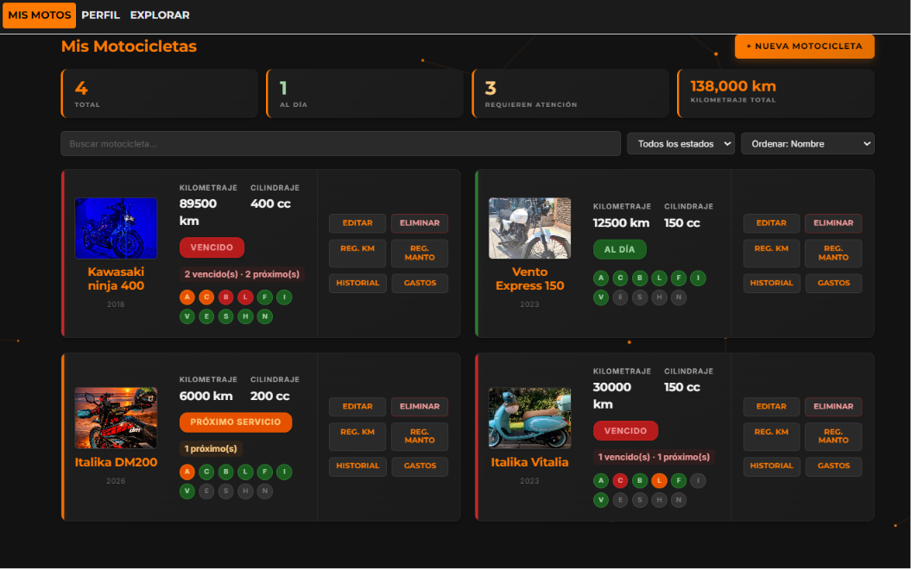
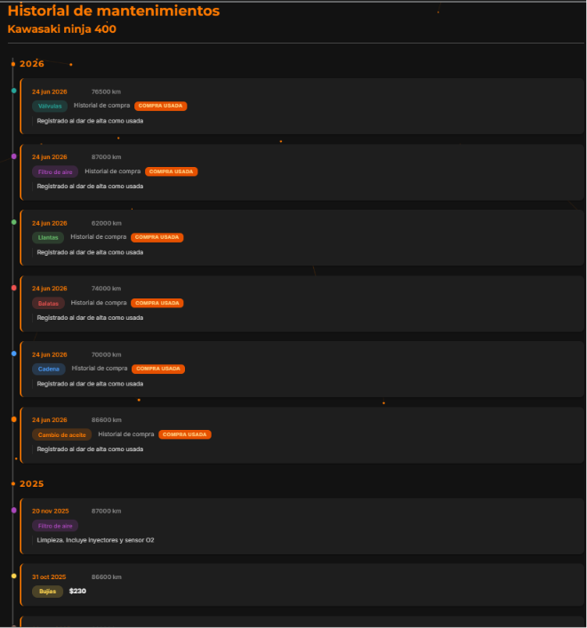
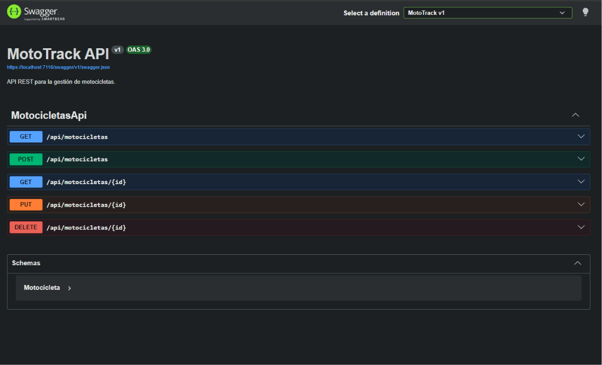

<p align="center">
  <picture>
    <source media="(prefers-color-scheme: dark)" srcset="../branding/social/mototrack-github-banner.svg">
    
  </picture>
</p>

<br>

<p align="center">
  <picture>
    <source media="(prefers-color-scheme: dark)" srcset="../branding/logo/mototrack-logo.svg">
    
  </picture>
</p>

# MotoTrack

**Smart motorcycle maintenance tracking.**

---

## Descripción

MotoTrack es una aplicación web ASP.NET Core MVC para la gestión integral del mantenimiento de motocicletas. Permite a los motociclistas registrar sus vehículos, controlar el kilometraje, programar servicios, visualizar alertas inteligentes de mantenimiento y gestionar gastos asociados. Incluye una API REST documentada con Swagger/OpenAPI.

El proyecto implementa una arquitectura por capas con 5 proyectos independientes, 2 proveedores de persistencia seleccionables mediante configuración (Entity Framework Core + SQLite y JSON), 3 patrones de diseño GOF (Repository, Strategy, Decorator) y documentación arquitectónica mediante ADR.

---

## Características principales

- Registro e inicio de sesión.
- Gestión de motocicletas.
- Historial de mantenimientos.
- Registro de kilometraje.
- Dashboard inteligente.
- Alertas de mantenimiento.
- Perfil de usuario.
- Gestión de gastos.
- API REST.
- Swagger/OpenAPI.
- Repository Pattern para abstracción de persistencia.
- Strategy para cálculo del estado de mantenimiento.
- Decorator para trazabilidad del repositorio.

---

## Capturas del sistema

### Dashboard principal

Panel principal de MotoTrack donde el usuario puede consultar el estado general de mantenimiento de la motocicleta seleccionada, visualizar alertas activas y conocer los últimos y próximos servicios recomendados.


---

### Mis motocicletas

Vista que permite administrar todas las motocicletas registradas, consultar su estado general y acceder rápidamente al historial, gastos, registro de kilometraje y mantenimientos.



---

### Historial de mantenimientos

Línea de tiempo con el historial completo de servicios realizados, incluyendo fecha, kilometraje, categoría, proveedor y observaciones cuando existen.



---

### Swagger UI

Documentación interactiva de la API REST que permite explorar y probar todos los endpoints disponibles.



---

### Consulta mediante API REST

Resultado de la ejecución del endpoint GET /api/motocicletas mostrando la respuesta JSON generada por MotoTrack.


---

## Tecnologías utilizadas

* ASP.NET Core MVC (.NET 10)
* C#
* Razor Views
* Bootstrap
* Entity Framework Core
* SQLite
* JSON (proveedor de persistencia alternativo)
* Swagger / OpenAPI
* Git
* GitHub

---

## Arquitectura implementada

MotoTrack implementa una Arquitectura por Capas compuesta por las siguientes capas:

- Presentación
- Aplicación
- Dominio
- Infraestructura

La persistencia utiliza Repository Pattern para abstraer el mecanismo de almacenamiento. Actualmente existen dos proveedores de persistencia seleccionables mediante configuración:

- **Entity Framework Core + SQLite**: proveedor principal basado en base de datos relacional.
- **JSON**: proveedor alternativo para compatibilidad con implementaciones previas.

El proveedor activo se define en `appsettings.json` mediante la clave `Persistence:Provider`. La lógica de negocio permanece completamente independiente del mecanismo de persistencia.

La evolución arquitectónica del proyecto está documentada mediante ADR (Architecture Decision Records).

---

## Patrones de diseño implementados

### Repository Pattern

Abstrae completamente la persistencia de datos mediante interfaces definidas en la capa de Dominio. Cada repositorio concreto (JSON o Entity Framework Core) implementa la misma interfaz, lo que permite cambiar entre proveedores sin modificar los servicios ni los controladores.

### Strategy

Permite determinar dinámicamente el estado de mantenimiento de cada componente de la motocicleta utilizando distintas estrategias de cálculo según el criterio seleccionado.

### Decorator

Añade trazabilidad sobre el repositorio de motocicletas sin modificar su implementación original, registrando cada operación realizada.

---

## API REST

MotoTrack incorpora una API REST documentada mediante Swagger.

La documentación interactiva se encuentra disponible en /swagger.

Endpoints disponibles:

- GET /api/motocicletas
- GET /api/motocicletas/{id}
- POST /api/motocicletas
- PUT /api/motocicletas/{id}
- DELETE /api/motocicletas/{id}

---

## Persistencia

MotoTrack soporta dos proveedores de persistencia seleccionables mediante configuración:

### JSON

```json
"Persistence": {
  "Provider": "Json"
}
```

### Entity Framework Core + SQLite

```json
"Persistence": {
  "Provider": "EntityFramework"
}
```

El sistema lee la clave `Persistence:Provider` de `appsettings.json` en el inicio y registra los repositorios correspondientes. Esta estrategia permitió una migración incremental desde JSON hacia Entity Framework Core sin modificar la lógica de negocio ni los controladores.

---

## Instalación

### Requisitos

- .NET SDK 10
- Visual Studio 2026 o superior

### Compilar

```
dotnet restore
dotnet build
```

### Ejecutar

```
dotnet run
```

La aplicación utilizará el proveedor de persistencia configurado en `appsettings.json` (`Persistence:Provider`).

---

## Roadmap Arquitectónico

| ADR | Etapa | Descripción |
|------|--------|-------------|
| ADR-01 | Arquitectura Inicial | Arquitectura por capas con persistencia JSON |
| ADR-02 | Vistas Arquitectónicas | Documentación mediante modelo 4+1 |
| ADR-03 | Estilo Arquitectónico | Formalización de arquitectura por capas |
| ADR-04 | API REST | Exposición de endpoints REST documentados con Swagger |
| ADR-05 | Patrones GOF | Incorporación de Strategy + Decorator para estado de mantenimiento y trazabilidad |
| ADR-06 | Technical Debt | Identificación y priorización de deuda técnica acumulada |
| ADR-07 | DashboardViewModel Technical Debt | Refactorización del DashboardViewModel para eliminar deuda técnica |

---

## Documentación Arquitectónica

Las decisiones arquitectónicas del proyecto se encuentran documentadas en:

- docs/adr/ADR-01-Arquitectura-Inicial.md
- docs/adr/ADR-02-Vistas-Arquitectonicas.md
- docs/adr/ADR-03-Estilo-Arquitectonico.md
- docs/adr/ADR-04-Incorporacion-API-REST.md
- docs/adr/ADR-05-Patrones-GOF.md
- docs/adr/ADR-06-Technical-Debt.md
- docs/adr/ADR-07-DashboardViewModel-Technical-Debt.md

El uso de herramientas de inteligencia artificial se documenta en:

- docs/IA.md

---

## Estado Actual

MotoTrack actualmente cuenta con arquitectura por capas documentada, Repository Pattern con dos proveedores de persistencia (Entity Framework Core + SQLite y JSON), API REST, Swagger, Strategy, Decorator y documentación arquitectónica mediante ADR. El proyecto continúa evolucionando mediante mejoras incrementales.

---

## Estructura del proyecto

```
Catalogo/                          ← Proyecto web (ASP.NET Core MVC)
├── Controllers/                   ← Controladores MVC y API REST
├── Views/                         ← Vistas Razor
├── Models/                        ← ViewModels
├── Helpers/                       ← Lógica auxiliar
├── Data/                          ← Archivos JSON de persistencia
├── docs/                          ← Documentación arquitectónica (ADR, diagramas, IA)
├── Properties/                    ← Configuración del proyecto
├── wwwroot/                       ← Archivos estáticos (CSS, JS, imágenes)
├── screenshots/                   ← Capturas del sistema
├── appsettings.json               ← Configuración de la aplicación
└── Program.cs                     ← Punto de entrada

MotoTrack.Domain/                  ← Capa de dominio
├── Models/                        ← Entidades del dominio
├── Interfaces/                    ← Contratos de repositorios
└── Enums/                         ← Enumeraciones

MotoTrack.Application/             ← Capa de aplicación
├── Services/                      ← Servicios de aplicación
├── Strategies/                    ← Estrategias de cálculo
└── KnowledgeBase/                 ← Base de conocimiento de mantenimiento

MotoTrack.Infrastructure/          ← Capa de infraestructura
├── Repositories/                  ← Repositorios JSON
├── Persistence/
│   ├── MotoTrackDbContext.cs      ← DbContext de EF Core
│   ├── Configurations/            ← Configuración Fluent API
│   ├── Repositories/              ← Repositorios EF Core
│   └── Migrations/                ← Migraciones de base de datos
└── Decorators/                    ← Decorador para trazabilidad
```

---

## Autor

David Morales Guerrero

Tecnológico del Software

Materia: Arquitectura de Software

---

## Uso de Inteligencia Artificial

Se utilizó ChatGPT como herramienta de apoyo para investigación, resolución de problemas y documentación. Las decisiones finales fueron tomadas y verificadas por el autor.
