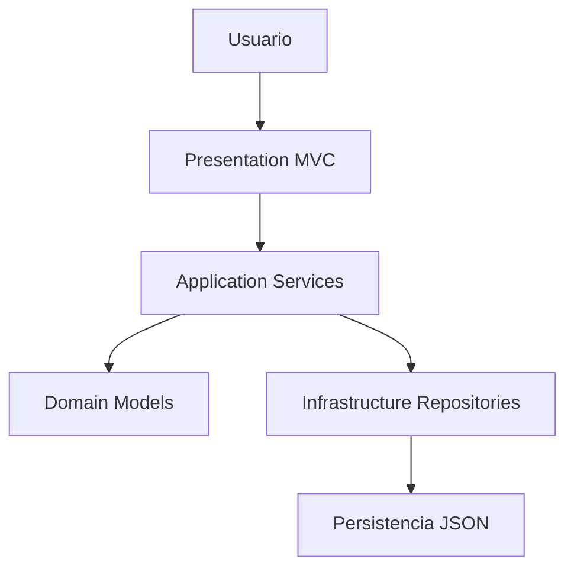

# ADR-01: Arquitectura Inicial de MotoTrack

| Campo  | Valor                  |
| ------ | ---------------------- |
| Autor  | David Morales Guerrero |
| Fecha  | 2026-05-15             |
| Estado | Aceptado               |

---

## Contexto

MotoTrack es una aplicación web desarrollada para ayudar a propietarios de motocicletas a llevar el control de sus unidades, registrar mantenimientos, monitorear kilometraje y consultar el historial de servicios realizados.

El sistema está orientado a usuarios que utilizan motocicletas de forma frecuente y requieren una herramienta sencilla para centralizar información relacionada con el mantenimiento preventivo y correctivo de sus vehículos.

Durante la etapa inicial del proyecto se requería construir una solución funcional que permitiera implementar rápidamente las funcionalidades principales sin introducir una complejidad arquitectónica innecesaria.

Las principales restricciones identificadas fueron:

* Desarrollo individual.
* Tiempo limitado del cuatrimestre.
* Conocimientos disponibles en ASP.NET Core y C#.
* Necesidad de mantener el proyecto organizado y escalable.
* Posibilidad de incorporar nuevas funcionalidades en etapas posteriores.

---

## Decisión

Se adopta una arquitectura por capas utilizando ASP.NET Core MVC como framework principal de desarrollo.

La solución se organiza en las siguientes capas:

* Presentation (MVC)
* Application
* Domain
* Infrastructure

Además, se implementan los patrones Repository y Service Layer para separar responsabilidades y reducir el acoplamiento entre la lógica de negocio y la persistencia de datos.

### ¿Por qué?

La arquitectura por capas permite dividir claramente las responsabilidades del sistema, facilitando el mantenimiento, la comprensión del código y la incorporación de nuevas funcionalidades.

El uso de ASP.NET Core MVC proporciona una estructura estable para aplicaciones web, mientras que Repository y Service Layer permiten centralizar reglas de negocio y abstraer los mecanismos de acceso a datos.

Esta decisión favorece la evolución futura del proyecto sin necesidad de realizar cambios drásticos en la estructura general de la aplicación.

### Alternativas consideradas

| Alternativa                            | Por qué la descarté                                                                                                |
| -------------------------------------- | ------------------------------------------------------------------------------------------------------------------ |
| Aplicación monolítica sin capas        | Mezcla responsabilidades y dificulta el mantenimiento conforme crece el sistema.                                   |
| PHP tradicional                        | Menor alineación con las tecnologías vistas durante el curso y menor consistencia arquitectónica para el proyecto. |
| Arquitectura Hexagonal desde el inicio | Agrega complejidad innecesaria para una primera versión funcional del sistema.                                     |
| Microservicios                         | Sobredimensionado para un proyecto académico desarrollado por una sola persona.                                    |

---

## Consecuencias

### Lo que gano

#### Consecuencias técnicas

* Separación clara de responsabilidades.
* Mayor mantenibilidad del código.
* Posibilidad de reemplazar mecanismos de persistencia sin afectar la lógica de negocio.
* Base sólida para futuras ampliaciones del sistema.

#### Consecuencias para el proceso

* Organización más clara del proyecto.
* Facilita la incorporación de nuevas funcionalidades por etapas.
* Permite documentar y evolucionar la arquitectura mediante ADR posteriores.

###  Lo que sacrifico o asumo

#### Limitaciones técnicas

* Mayor cantidad de archivos y proyectos respecto a una aplicación simple.
* Incremento inicial de complejidad estructural.

#### Riesgos y deuda técnica

* Si el sistema crece significativamente, podrían requerirse estilos arquitectónicos más especializados.
* Será necesario mantener disciplina en la separación de responsabilidades para evitar acoplamiento entre capas.

---

## Diagrama

El sistema se organiza mediante una arquitectura por capas donde la interfaz de usuario se comunica con la capa de aplicación, la lógica de negocio se mantiene en dominio y el acceso a datos se concentra en infraestructura.

---

> **Nota:** Esta decisión inicial fue posteriormente reforzada y formalizada en [ADR-03](ADR-03-Estilo-Arquitectonico.md), donde se detallan los componentes actuales de cada capa según la implementación real del proyecto.
