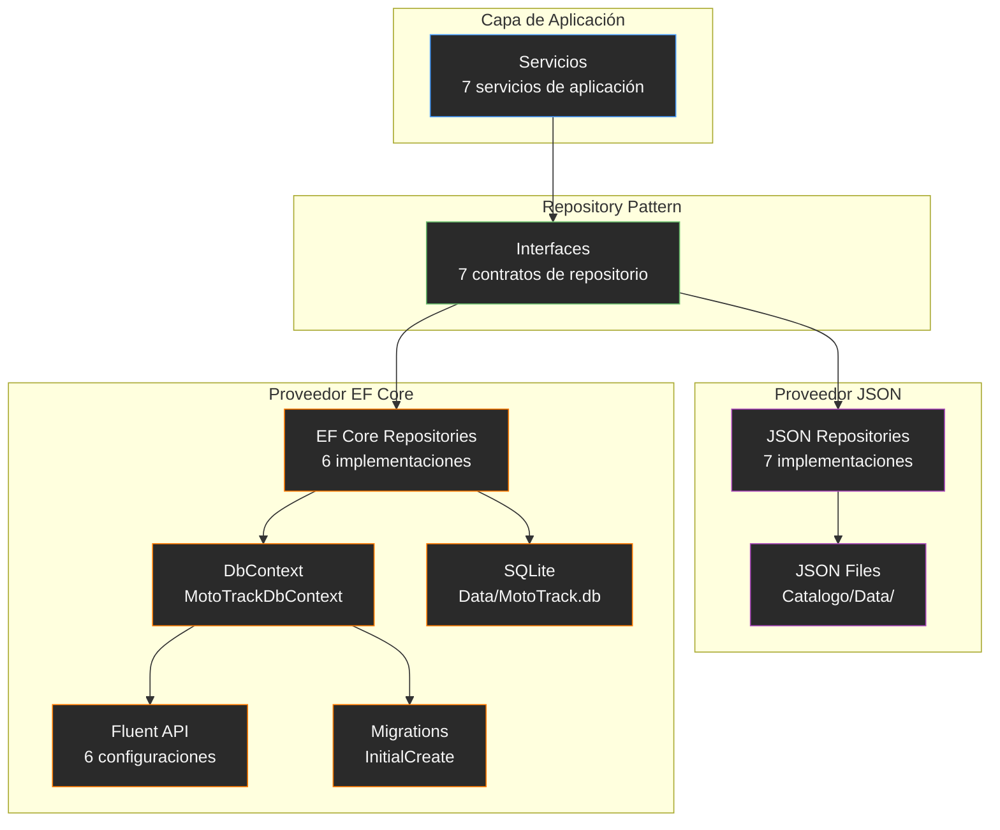

# ADR-08: Migración a Entity Framework Core y SQLite

## Estado

Aceptada

## Fecha

2026-07-15

## Autor

David Morales Guerrero

---

## Contexto

MotoTrack comenzó su desarrollo utilizando persistencia basada en archivos JSON, almacenando cada entidad en un archivo independiente dentro del directorio `Catalogo/Data/`. Esta estrategia fue adecuada durante las etapas iniciales del proyecto, permitiendo un ciclo de desarrollo rápido sin sobrecarga de infraestructura.

Conforme el proyecto creció y se incorporaron nuevas funcionalidades (dashboard, alertas inteligentes, API REST, centro de notificaciones, perfil de usuario), las limitaciones de la persistencia JSON comenzaron a hacerse evidentes. El sistema requería una solución más escalable que soportara relaciones entre entidades, consultas optimizadas y migraciones controladas, sin perder la compatibilidad con la implementación existente.

---

## Problema

La persistencia mediante archivos JSON presentaba las siguientes limitaciones:

- **Ausencia de relaciones**: no existía integridad referencial entre entidades. Las relaciones entre Usuario, Motocicleta, Mantenimiento y Gasto se resolvían en memoria mediante LINQ sobre listas deserializadas.
- **Consultas limitadas**: cada operación requería cargar, deserializar, filtrar y serializar el archivo completo. No existían índices ni optimización de consultas.
- **Falta de migraciones**: los cambios en la estructura de datos requerían migraciones manuales o conversiones ad-hoc. No existía un mecanismo automatizado para evolucionar el esquema.
- **Mantenimiento creciente**: cada nuevo repositorio duplicaba el patrón de lectura y escritura de archivos, incrementando la deuda técnica.
- **Escalabilidad reducida**: el número de operaciones de E/S sobre archivos crecía linealmente con el volumen de datos.

Estas limitaciones no impedían el funcionamiento del sistema, pero aumentaban la complejidad de mantenimiento y reducían la capacidad de evolución futura.

---

## Alternativas evaluadas

| Alternativa | Descripción | Motivo de descarte |
|---|---|---|
| **Continuar únicamente con JSON** | Mantener la persistencia JSON como única opción sin incorporar base de datos. | Las limitaciones de relaciones, consultas y migraciones seguirían presentes. El proyecto no escalaría a funcionalidades más complejas. |
| **Entity Framework Core + SQLite (seleccionado)** | ORM de Microsoft con SQLite como motor de base de datos embebido. | Proporciona integridad referencial, migraciones, consultas optimizadas y coexistencia con la implementación JSON existente. SQLite no requiere instalación de servidor, lo que simplifica el despliegue. |
| **SQL Server** | Base de datos relacional con SQL Server LocalDB o Express. | Requiere instalación de SQL Server o LocalDB. Agrega complejidad de configuración para un proyecto académico con alcance actual. |
| **PostgreSQL** | Base de datos relacional open source. | Requiere instalación y configuración de servidor externo. Sobredimensionado para el alcance actual del proyecto. |

SQLite fue seleccionado porque combina las ventajas de una base de datos relacional con la simplicidad operativa de un archivo embebido, alineándose con el perfil académico del proyecto y la ausencia de requisitos de concurrencia masiva.

---

## Decisión

Se adopta Entity Framework Core con SQLite como nuevo proveedor de persistencia para MotoTrack. La implementación sigue los siguientes lineamientos:

- **Entity Framework Core** como ORM para acceso a datos.
- **SQLite** como motor de base de datos relacional.
- **Fluent API** para la configuración del mapeo objeto-relacional, evitando DataAnnotations en las entidades de dominio.
- **Repository Pattern** existente como abstracción entre la lógica de negocio y el mecanismo de persistencia.
- **Coexistencia temporal** con la implementación JSON para permitir una migración incremental.
- **Selección del proveedor mediante configuración** en `appsettings.json`.

El proveedor activo se define mediante la clave `Persistence:Provider`:

```json
"Persistence": {
  "Provider": "Json"
}
```

```json
"Persistence": {
  "Provider": "EntityFramework"
}
```

---

## Implementación

La migración incorporó los siguientes componentes:

- **MotoTrackDbContext**: DbContext que expone DbSet para cada entidad del dominio (Usuarios, Motocicletas, Mantenimientos, LecturasKilometraje, Gastos, ConfiguracionesMantenimiento).
- **Configuraciones Fluent API**: una clase `IEntityTypeConfiguration<T>` por cada entidad, definiendo nombres de tabla, propiedades, longitudes máximas, tipos de columna, relaciones, delete behavior e índices.
- **Repositorios EF Core**: seis implementaciones concretas de las interfaces del dominio (`MotocicletaRepositoryEF`, `MantenimientoRepositoryEF`, `LecturaKilometrajeRepositoryEF`, `GastoRepositoryEF`, `ConfiguracionMantenimientoRepositoryEF`, `UsuarioRepositoryEF`), cada una utilizando `AsNoTracking()` en lecturas y `SaveChanges()` en escrituras.
- **Migraciones**: migración `InitialCreate` que genera el esquema completo con 6 tablas, claves primarias, claves foráneas, índices y restricciones de integridad.
- **Registro en DI**: `MotoTrackDbContext` registrado con `AddDbContext` y cadena de conexión SQLite desde `appsettings.json`.
- **Provider Selection**: el registro de los repositorios en el Composition Root (`Program.cs`) selecciona la implementación JSON o EF Core según el valor de `Persistence:Provider`.

Las relaciones se configuraron con `DeleteBehavior.Restrict` para la relación Usuario → Motocicleta y `DeleteBehavior.Cascade` para el resto. La entidad `ConfiguracionMantenimiento` utiliza `MotocicletaId` como clave primaria directa (relación 1:1 con Motocicleta).

---

## Consecuencias positivas

- Mayor mantenibilidad: la configuración centralizada mediante Fluent API facilita la evolución del esquema.
- Mayor escalabilidad: las consultas se ejecutan directamente en SQLite con soporte de índices.
- Soporte para relaciones: integridad referencial gestionada por la base de datos mediante claves foráneas.
- Soporte para migraciones: los cambios en el modelo de datos se gestionan mediante migraciones de EF Core.
- Consultas optimizadas: EF Core traduce LINQ a SQL, eliminando la necesidad de cargar conjuntos completos en memoria.
- Independencia de la persistencia: la lógica de negocio permanece desacoplada del mecanismo de almacenamiento gracias al Repository Pattern.
- Transición sin impacto: ningún controlador ni servicio fue modificado durante la migración. El cambio de proveedor se realiza exclusivamente en la configuración.

---

## Consecuencias negativas

- Mayor complejidad de infraestructura: el proyecto ahora incluye DbContext, configuraciones Fluent API, repositorios EF Core y migraciones, incrementando el número de archivos y la curva de aprendizaje.
- Coexistencia temporal de dos proveedores: mantener ambas implementaciones (JSON y EF Core) duplica el código de repositorios y requiere mantener sincronizadas ambas versiones durante la transición.
- Incremento de documentación: la incorporación de EF Core requirió actualizar ADR-03 y crear el presente ADR para reflejar el nuevo estado arquitectónico.

---

## Diagrama

El siguiente diagrama representa la estrategia de persistencia dual de MotoTrack:


