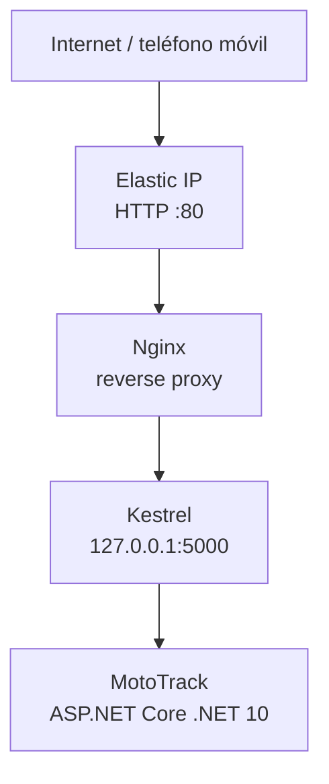

# MotoTrack — AWS Deployment

## Propósito

Este documento describe el despliegue público **actual** de MotoTrack en Amazon EC2 para la demostración académica. Documenta únicamente la infraestructura real existente; no describe componentes que no estén implementados.

---

## Arquitectura de ejecución



## Componentes

| Componente | Rol |
|---|---|
| Amazon EC2 | Instancia que ejecuta la aplicación y su servicio. |
| Ubuntu | Sistema operativo de la instancia. |
| Nginx | Reverse proxy: expone la aplicación públicamente por HTTP puerto 80. |
| systemd | Gestor de servicios; controla `mototrack.service`. |
| Kestrel | Servidor web de ASP.NET Core; escucha internamente en `http://127.0.0.1:5000`. |
| MotoTrack | Aplicación ASP.NET Core MVC .NET 10. |

---

## Servicio systemd

MotoTrack se ejecuta como un servicio gestionado por systemd:

```
mototrack.service
```

Configuración real auditada:

- **WorkingDirectory:** `/home/ubuntu/ArqSoft-S01-DavidMorales/Catalogo`
- **ASPNETCORE_ENVIRONMENT:** `Production`
- **ASPNETCORE_URLS:** `http://127.0.0.1:5000`

No se documentan aquí credenciales, claves ni información de acceso de la instancia.

---

## Nginx

Nginx actúa como reverse proxy público. Recibe el tráfico HTTP del puerto 80 y lo reenvía a Kestrel, que escucha únicamente en la interfaz local `127.0.0.1:5000`. Esto permite exponer MotoTrack de forma pública sin exponer Kestrel directamente.

---

## Acceso público

- **Elastic IP:** `3.134.42.251`
- **Aplicación:** http://3.134.42.251/
- **Presentación:** http://3.134.42.251/Home/Presentation

Actualmente el acceso público utiliza **HTTP** (puerto 80). **No** existe HTTPS/TLS configurado.

---

## Actualización manual

GitHub Actions proporciona **Integración Continua (CI)**: compila y ejecuta las pruebas en cada push o pull request a `main`. **No** proporciona Continuous Deployment (CD) hacia EC2.

El servidor se actualiza manualmente desde `main`. La secuencia real es:

```
cambio
→ rama correspondiente
→ validación (build + pruebas)
→ commit/push a GitHub
→ integración a main
→ actualización manual de main en EC2
→ validación del servicio
```

La rama `ci-cd` es de infraestructura y **no** es la rama desplegada en producción.

---

## Operación

Comandos de diagnóstico utilizados en el despliegue real:

```
sudo systemctl status mototrack --no-pager
sudo systemctl status nginx --no-pager
curl -I http://127.0.0.1:5000
curl -I http://localhost
```

---

## Detención

- Detener la instancia EC2 interrumpe la aplicación.
- La Elastic IP permanece asociada a la instancia.
- Al iniciar nuevamente, la IP pública permanece estable mientras la Elastic IP siga asociada.
- Antes de una demostración debe verificarse que el servicio esté activo y que el acceso público responda.

---

## Limitaciones actuales

- HTTP sin TLS/HTTPS.
- Sin dominio propio.
- Despliegue manual (sin Continuous Deployment).
- Instancia EC2 única.
- Sin alta disponibilidad.
- Sin balanceador ni autoscaling.
- Sin Docker/Kubernetes en este despliegue.
- Sin base de datos administrada en AWS (la persistencia es local a la aplicación).

---

*Para la identidad visual oficial de MotoTrack (colores, tipografía, logotipo), consultar [`BRAND_GUIDELINES.md`](../../branding/BRAND_GUIDELINES.md) — única fuente de verdad para los recursos gráficos del proyecto.*
