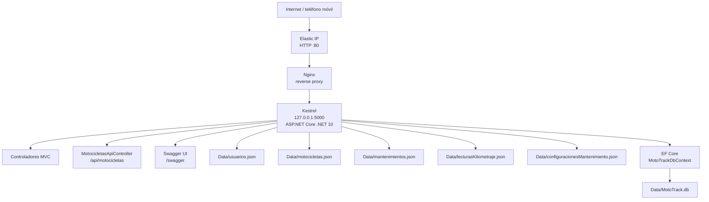

# Vista de Despliegue

## Descripción

La vista de despliegue muestra cómo se ejecuta MotoTrack y los elementos físicos involucrados en su funcionamiento, tanto en producción como en el entorno local de desarrollo.

## Despliegue en producción

## Interpretación

En **producción**, MotoTrack se ejecuta en una instancia **Amazon EC2** con **Ubuntu**, gestionada por **systemd** mediante el servicio `mototrack.service` (directorio de trabajo `/home/ubuntu/ArqSoft-S01-DavidMorales/Catalogo`, entorno `Production`). **Nginx** actúa como reverse proxy público por **HTTP puerto 80** y reenvía el tráfico a **Kestrel**, que escucha internamente en `http://127.0.0.1:5000`.

El acceso público se realiza mediante la **Elastic IP**:

- Aplicación: http://3.134.42.251/
- Presentación: http://3.134.42.251/Home/Presentation

La aplicación soporta dos proveedores de persistencia seleccionables mediante la clave `Persistence:Provider` en `appsettings.json`:

- **JSON**: los datos se almacenan en archivos JSON dentro del directorio `Catalogo/Data/`.
- **EntityFramework**: los datos se almacenan en una base de datos SQLite en `Catalogo/Data/MotoTrack.db` mediante Entity Framework Core.

La documentación operativa completa del despliegue se encuentra en [`../deployment/AWS_DEPLOYMENT.md`](../deployment/AWS_DEPLOYMENT.md).

---

## Entorno de desarrollo local

Para el desarrollo local, MotoTrack se ejecuta con Kestrel mediante `dotnet run` (perfil `http` en puerto 5141 o `https` en puerto 7116). Los usuarios acceden mediante un navegador web (interfaz MVC) o mediante clientes HTTP (API REST). Swagger UI está disponible en `/swagger` para explorar y probar los endpoints. También existe un perfil `IIS Express` opcional en `launchSettings.json`.

El entorno local y el despliegue de producción son entornos independientes: la configuración de puertos y proveedores del entorno de desarrollo no corresponde a la configuración del servicio en EC2.

---

*Para la identidad visual oficial de MotoTrack (colores, tipografía, logotipo), consultar [`BRAND_GUIDELINES.md`](../../branding/BRAND_GUIDELINES.md) — única fuente de verdad para los recursos gráficos del proyecto.*
