# Vista Lógica

## Descripción

La vista lógica muestra los principales componentes funcionales de MotoTrack y las relaciones entre la interfaz de usuario, los controladores, los servicios, los repositorios y la persistencia de datos.

```mermaid
flowchart TD

    U[Usuario]

    U --> C1[AuthController]
    U --> C2[MotocicletaController]
    U --> C3[MantenimientoController]
    U --> C4[LecturaKilometrajeController]
    U --> C5[PerfilController]
    U --> C6[MotoTrackController]
    U --> C7[HomeController]
    U --> C8[MotocicletasApiController]

    C1 --> S1[UsuarioService]

    C2 --> S2[MotocicletaService]
    C2 --> S5[ConfiguracionMantenimientoService]
    C2 --> S3[MantenimientoService]

    C3 --> S3[MantenimientoService]
    C3 --> S2[MotocicletaService]

    C4 --> S4[LecturaKilometrajeService]
    C4 --> S2[MotocicletaService]

    C5 --> S1[UsuarioService]
    C5 --> S2[MotocicletaService]
    C5 --> S3[MantenimientoService]

    C6 --> S6[ItemService]

    C7 --> S2[MotocicletaService]
    C7 --> S3[MantenimientoService]
    C7 --> S5[ConfiguracionMantenimientoService]

    C8 --> S2[MotocicletaService]

    S1 --> R1[UsuarioRepository]
    S2 --> R2[MotocicletaRepository]
    S3 --> R3[MantenimientoRepository]
    S4 --> R4[LecturaKilometrajeRepository]
    S5 --> R5[ConfiguracionMantenimientoRepository]
    S6 --> R6[ItemRepository]

    S1 --> E1[UsuarioRepositoryEF]
    S2 --> E2[MotocicletaRepositoryEF]
    S3 --> E3[MantenimientoRepositoryEF]
    S4 --> E4[LecturaKilometrajeRepositoryEF]
    S5 --> E5[ConfiguracionMantenimientoRepositoryEF]

    R1 --> D1[usuarios.json]
    R2 --> D2[motocicletas.json]
    R3 --> D3[mantenimientos.json]
    R4 --> D4[lecturasKilometraje.json]
    R5 --> D5[configuracionesMantenimiento.json]

    E1 --> DB[(SQLite<br/>MotoTrack.db)]
    E2 --> DB
    E3 --> DB
    E4 --> DB
    E5 --> DB
```

## Interpretación

MotoTrack utiliza una arquitectura por capas donde los usuarios interactúan con controladores MVC y endpoints API REST. Los controladores delegan la lógica de negocio a los servicios correspondientes y estos utilizan repositorios para acceder a los datos. El proveedor de persistencia activo (JSON o Entity Framework Core + SQLite) se selecciona mediante la clave `Persistence:Provider` en `appsettings.json`. El controlador `MotocicletasApiController` extiende la capa de presentación exponiendo los mismos servicios vía HTTP.

### Servicios adicionales

- `GastoService` e `IGastoRepository` gestionan gastos de mantenimiento. El repositorio concreto (`GastoRepository` o `GastoRepositoryEF`) se resuelve en el Composition Root según el valor de `Persistence:Provider`.
- `CalculadorEstadoMantenimiento` (Helper en `Catalogo/Helpers/`) es utilizado por `HomeController` y `MotocicletaController` para calcular el estado de los 6 tipos de mantenimiento.

---

*Para la identidad visual oficial de MotoTrack (colores, tipografía, logotipo), consultar [`BRAND_GUIDELINES.md`](../../branding/BRAND_GUIDELINES.md) — única fuente de verdad para los recursos gráficos del proyecto.*
