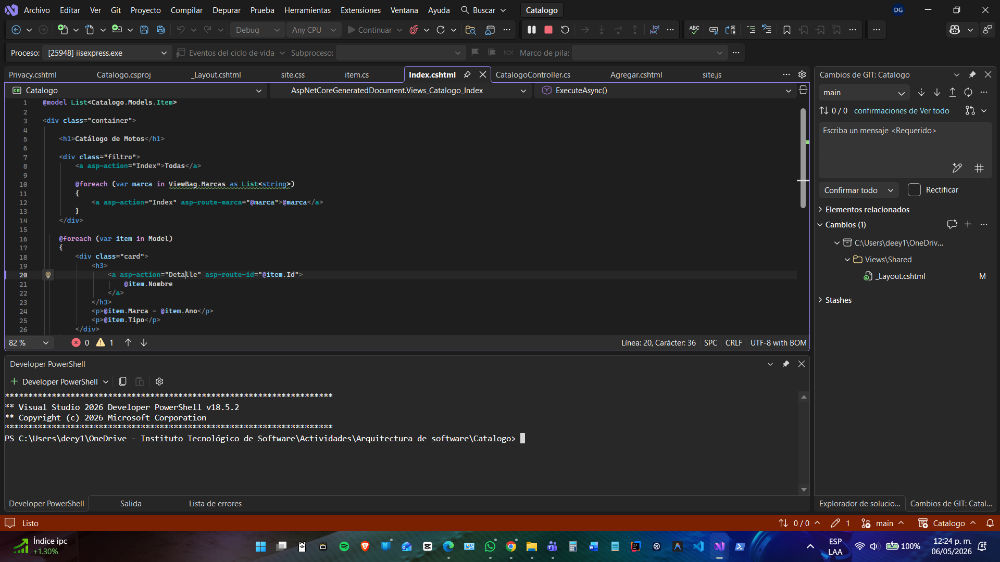
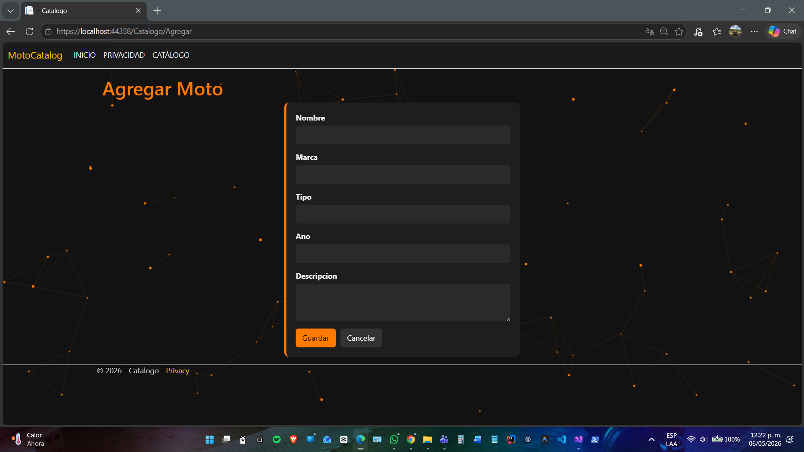
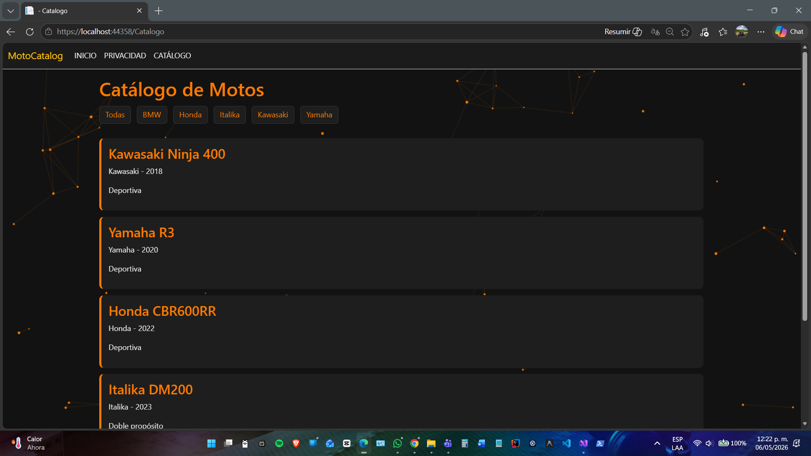
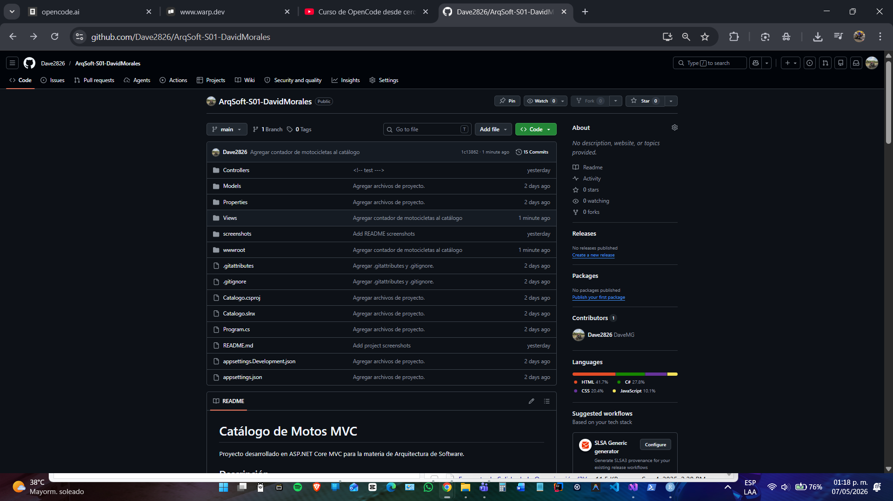

# Catálogo de Motos MVC

Proyecto desarrollado en ASP.NET Core MVC para la materia de Arquitectura de Software.

## Descripción

La aplicación permite visualizar, consultar y registrar motocicletas dentro de un catálogo dinámico organizado por marcas.

El sistema fue personalizado con una temática estilo racing/cyber inspirada en motocicletas deportivas, utilizando diseño oscuro, acentos naranjas y animaciones dinámicas con JavaScript.

---

## Funcionalidades

- Listado dinámico de motocicletas
- Filtro por marca
- Vista de detalle
- Registro de nuevas motos
- Organización automática de marcas
- Interfaz personalizada
- Fondo dinámico animado
- Diseño responsive

---

## Tecnologías utilizadas

- ASP.NET Core MVC
- C#
- Bootstrap
- CSS
- JavaScript

---

## Arquitectura utilizada

El proyecto utiliza el patrón MVC:

### Models
Representación de datos.

### Views
Interfaz visual.

### Controllers
Lógica y control de navegación.

---

## Estructura del proyecto

```text
Catalogo
│
├── Controllers
├── Models
├── Views
├── wwwroot
│   ├── css
│   ├── js
│   └── lib
└── Program.cs
```

---

## Uso de IA

La inteligencia artificial fue utilizada únicamente como apoyo para:
- personalización visual,
- mejora estética,
- organización de interfaz,
- y asistencia menor en estructura visual del proyecto.

La lógica principal, implementación MVC y configuración general fueron desarrolladas manualmente.

---

## Capturas de pantalla.

### Página principal


### Registro de motocicletas


### Desarrollo en Visual Studio


### Repositorio en GitHub


### Contador dinámico de motocicletas y actualizacion en GitHub
