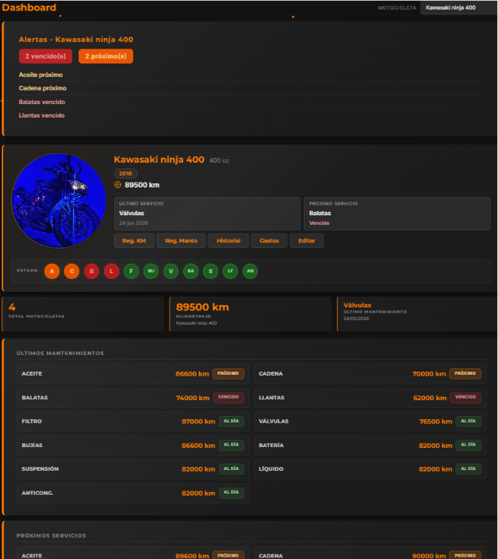
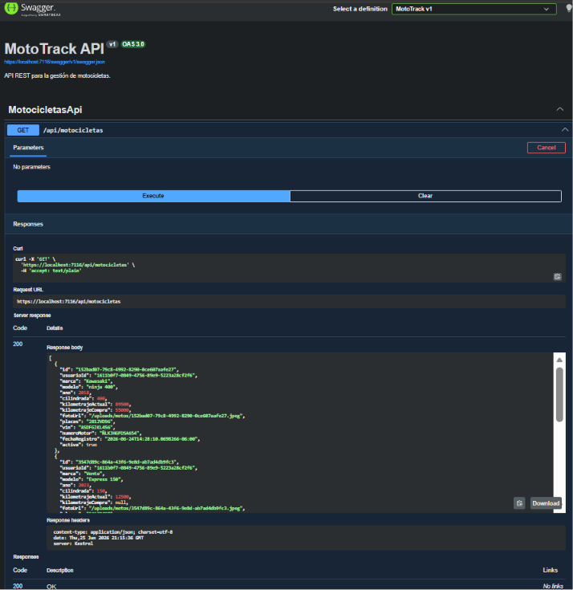

# MotoTrack

## Descripción

MotoTrack es una aplicación web desarrollada en ASP.NET Core MVC que permite a los motociclistas administrar sus motocicletas, registrar mantenimientos, controlar el kilometraje, visualizar alertas inteligentes de servicio, consultar el historial completo y utilizar una API REST documentada con Swagger.

El proyecto fue desarrollado como parte de la materia de Arquitectura de Software y evoluciona mediante entregas incrementales.

---

## Características principales

- Registro e inicio de sesión.
- Gestión de motocicletas.
- Historial de mantenimientos.
- Registro de kilometraje.
- Dashboard inteligente.
- Alertas de mantenimiento.
- Perfil de usuario.
- Gestión de gastos.
- API REST.
- Swagger/OpenAPI.
- Strategy para cálculo del estado de mantenimiento.
- Decorator para trazabilidad del repositorio.

---

## Capturas del sistema

### Dashboard principal

Panel principal de MotoTrack donde el usuario puede consultar el estado general de mantenimiento de la motocicleta seleccionada, visualizar alertas activas y conocer los últimos y próximos servicios recomendados.

---

### Mis motocicletas

Vista que permite administrar todas las motocicletas registradas, consultar su estado general y acceder rápidamente al historial, gastos, registro de kilometraje y mantenimientos.

---

### Historial de mantenimientos

Línea de tiempo con el historial completo de servicios realizados, incluyendo fecha, kilometraje, categoría, proveedor y observaciones cuando existen.

---

### Swagger UI

Documentación interactiva de la API REST que permite explorar y probar todos los endpoints disponibles.

---

### Consulta mediante API REST

Resultado de la ejecución del endpoint GET /api/motocicletas mostrando la respuesta JSON generada por MotoTrack.

---

## Tecnologías utilizadas

* ASP.NET Core MVC
* C#
* Razor Views
* Bootstrap
* JSON para persistencia local
* Swagger / OpenAPI
* Git
* GitHub

---

## Arquitectura implementada

MotoTrack implementa una Arquitectura por Capas compuesta por las siguientes capas:

- Presentación
- Aplicación
- Dominio
- Infraestructura

La evolución arquitectónica del proyecto está documentada mediante ADR (Architecture Decision Records).

---

## Patrones de diseño implementados

### Strategy

Permite determinar dinámicamente el estado de mantenimiento de cada componente de la motocicleta utilizando distintas estrategias de cálculo según el criterio seleccionado.

### Decorator

Añade trazabilidad sobre el repositorio de motocicletas sin modificar su implementación original, registrando cada operación realizada.

---

## API REST

MotoTrack incorpora una API REST documentada mediante Swagger.

La documentación interactiva se encuentra disponible en /swagger.

Endpoints disponibles:

- GET /api/motocicletas
- GET /api/motocicletas/{id}
- POST /api/motocicletas
- PUT /api/motocicletas/{id}
- DELETE /api/motocicletas/{id}

---

## Roadmap Arquitectónico

| ADR | Etapa | Descripción |
|------|--------|-------------|
| ADR-01 | Arquitectura Inicial | Arquitectura por capas con persistencia JSON |
| ADR-02 | Vistas Arquitectónicas | Documentación mediante modelo 4+1 |
| ADR-03 | Estilo Arquitectónico | Formalización de arquitectura por capas |
| ADR-04 | API REST | Exposición de endpoints REST documentados con Swagger |
| ADR-05 | Patrones GOF | Incorporación de Strategy + Decorator para estado de mantenimiento y trazabilidad |

---

## Documentación Arquitectónica

Las decisiones arquitectónicas del proyecto se encuentran documentadas en:

- docs/adr/ADR-01-Arquitectura-Inicial.md
- docs/adr/ADR-02-Vistas-Arquitectonicas.md
- docs/adr/ADR-03-Estilo-Arquitectonico.md
- docs/adr/ADR-04-Incorporacion-API-REST.md
- docs/adr/ADR-05-Patrones-GOF.md

El uso de herramientas de inteligencia artificial se documenta en:

- docs/IA.md

---

## Estado Actual

MotoTrack actualmente cuenta con arquitectura por capas documentada, API REST, Swagger, persistencia JSON, Strategy y Decorator. El proyecto continúa evolucionando mediante mejoras incrementales.

---

## Autor

David Morales Guerrero

Tecnológico del Software

Materia: Arquitectura de Software

---

## Uso de Inteligencia Artificial

Se utilizó ChatGPT como herramienta de apoyo para investigación, resolución de problemas y documentación. Las decisiones finales fueron tomadas y verificadas por el autor.
