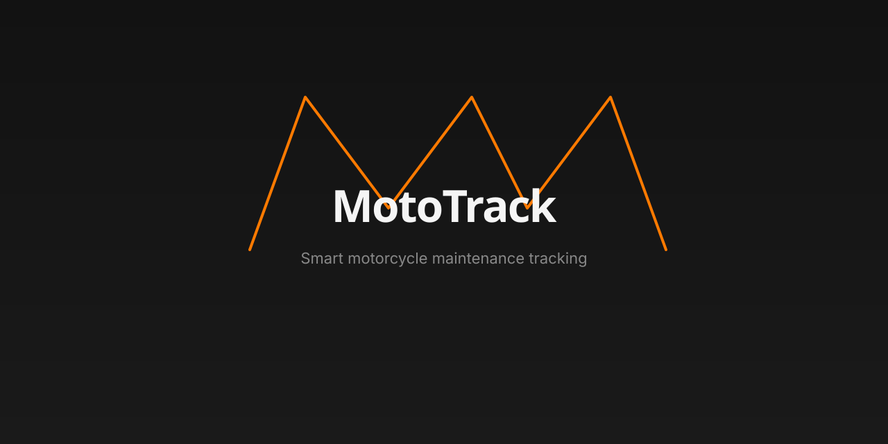
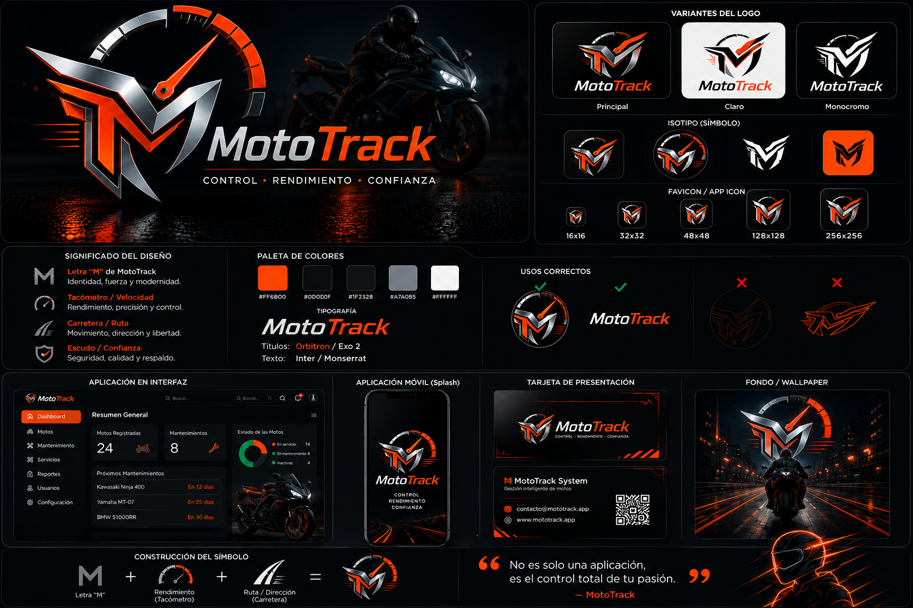

<p align="center">
  <picture>
    <source media="(prefers-color-scheme: dark)" srcset="branding/logo/social/mototrack-github-banner.svg">
    
  </picture>
</p>

<br>

<p align="center">
  <picture>
    <source media="(prefers-color-scheme: dark)" srcset="branding/logo/primary/mototrack-logo-primary.svg">
    
  </picture>
</p>

# MotoTrack

**Smart motorcycle maintenance tracking.**

---

## Descripción

MotoTrack es una aplicación web ASP.NET Core MVC para la gestión integral del mantenimiento de motocicletas. Permite a los motociclistas registrar sus vehículos, controlar el kilometraje, programar servicios, visualizar alertas inteligentes de mantenimiento y gestionar gastos asociados. Incluye una API REST documentada con Swagger/OpenAPI.

El proyecto implementa una arquitectura por capas con 5 proyectos independientes, 2 proveedores de persistencia seleccionables mediante configuración (Entity Framework Core + SQLite y JSON), 3 patrones de diseño GOF (Repository, Strategy, Decorator) y documentación arquitectónica mediante ADR.

---

<p align="center">
  
  
  
  
  
  
</p>

## Tabla de contenidos

- [Descripción](#descripción)
- [Captura principal](#captura-principal)
- [Características](#características)
- [Arquitectura](#arquitectura)
- [Tecnologías](#tecnologías)
- [API REST](#api-rest)
- [Persistencia](#persistencia)
- [Instalación](#instalación)
- [Estructura del repositorio](#estructura-del-repositorio)
- [Documentación](#documentación)
- [Branding](#branding)
- [Roadmap Arquitectónico](#roadmap-arquitectónico)
- [Estado del proyecto](#estado-del-proyecto)
- [Autor](#autor)
- [Uso de Inteligencia Artificial](#uso-de-inteligencia-artificial)

---

## Captura principal



El panel principal de MotoTrack permite al usuario consultar el estado general de mantenimiento de la motocicleta seleccionada, visualizar alertas activas y conocer los últimos y próximos servicios recomendados.

---

### Capturas del sistema

#### Dashboard principal

Vista del dashboard dentro de la aplicación, con el resumen de mantenimiento de la motocicleta seleccionada.


---

#### Mis motocicletas

Vista que permite administrar todas las motocicletas registradas, consultar su estado general y acceder rápidamente al historial, gastos, registro de kilometraje y mantenimientos.


---

#### Historial de mantenimientos

Línea de tiempo con el historial completo de servicios realizados, incluyendo fecha, kilometraje, categoría, proveedor y observaciones cuando existen.


---

#### Swagger UI

Documentación interactiva de la API REST que permite explorar y probar todos los endpoints disponibles.


---

#### Consulta mediante API REST

Resultado de la ejecución del endpoint GET /api/motocicletas mostrando la respuesta JSON generada por MotoTrack.


---

## Características

- Registro e inicio de sesión.
- Gestión de motocicletas.
- Historial de mantenimientos.
- Registro de kilometraje.
- Dashboard inteligente.
- Alertas de mantenimiento.
- Perfil de usuario.
- Gestión de gastos.
- API REST.
- Swagger/OpenAPI.
- Repository Pattern para abstracción de persistencia.
- Strategy para cálculo del estado de mantenimiento.
- Decorator para trazabilidad del repositorio.

---

## Arquitectura

MotoTrack está construido sobre una base técnica orientada al mantenimiento a largo plazo:

- **Arquitectura por Capas** alineada con los principios de **Clean Architecture**: Presentación, Aplicación, Dominio e Infraestructura.
- **ASP.NET Core MVC** como framework web.
- **Entity Framework Core + SQLite** como proveedor de persistencia principal (en migración desde JSON).
- **Repository Pattern** para abstraer el mecanismo de almacenamiento.
- **Dependency Injection** nativa de ASP.NET Core.
- **SOLID** como principios de diseño.

La decisión de adoptar la arquitectura por capas está formalizada en el [ADR-03: Estilo Arquitectónico](Catalogo/docs/adr/ADR-03-Estilo-Arquitectonico.md).

### Arquitectura implementada

MotoTrack implementa una Arquitectura por Capas compuesta por las siguientes capas:

- Presentación
- Aplicación
- Dominio
- Infraestructura

La persistencia utiliza Repository Pattern para abstraer el mecanismo de almacenamiento. Actualmente existen dos proveedores de persistencia seleccionables mediante configuración:

- **Entity Framework Core + SQLite**: proveedor principal basado en base de datos relacional.
- **JSON**: proveedor alternativo para compatibilidad con implementaciones previas.

El proveedor activo se define en `appsettings.json` mediante la clave `Persistence:Provider`. La lógica de negocio permanece completamente independiente del mecanismo de persistencia.

La evolución arquitectónica del proyecto está documentada mediante ADR (Architecture Decision Records).

### Patrones de diseño implementados

#### Repository Pattern

Abstrae completamente la persistencia de datos mediante interfaces definidas en la capa de Dominio. Cada repositorio concreto (JSON o Entity Framework Core) implementa la misma interfaz, lo que permite cambiar entre proveedores sin modificar los servicios ni los controladores.

#### Strategy

Permite determinar dinámicamente el estado de mantenimiento de cada componente de la motocicleta utilizando distintas estrategias de cálculo según el criterio seleccionado.

#### Decorator

Añade trazabilidad sobre el repositorio de motocicletas sin modificar su implementación original, registrando cada operación realizada.

---

## Tecnologías

* ASP.NET Core MVC (.NET 10)
* C#
* Razor Views
* Bootstrap
* Entity Framework Core
* SQLite
* JSON (proveedor de persistencia alternativo)
* Swagger / OpenAPI
* Git
* GitHub

---

## API REST

API REST documentada con Swagger/OpenAPI, disponible en `/swagger`.

| Método | Endpoint | Descripción |
|--------|----------|-------------|
| GET | `/api/motocicletas` | Listar todas las motocicletas |
| GET | `/api/motocicletas/{id}` | Obtener motocicleta por ID |
| POST | `/api/motocicletas` | Crear una motocicleta |
| PUT | `/api/motocicletas/{id}` | Actualizar una motocicleta |
| DELETE | `/api/motocicletas/{id}` | Eliminar una motocicleta |

---

## Persistencia

MotoTrack soporta dos proveedores de persistencia seleccionables mediante configuración:

### JSON

```json
"Persistence": {
  "Provider": "Json"
}
```

### Entity Framework Core + SQLite

```json
"Persistence": {
  "Provider": "EntityFramework"
}
```

El sistema lee la clave `Persistence:Provider` de `appsettings.json` en el inicio y registra los repositorios correspondientes. Esta estrategia permitió una migración incremental desde JSON hacia Entity Framework Core sin modificar la lógica de negocio ni los controladores.

---

## Instalación

### Requisitos

- .NET SDK 10
- Visual Studio 2026 o superior

### Compilar

```
dotnet restore
dotnet build
```

### Ejecutar

```
dotnet run
```

La aplicación utilizará el proveedor de persistencia configurado en `appsettings.json` (`Persistence:Provider`).

---

## Estructura del repositorio

```
MotoTrack/
├── Catalogo/                    ← Proyecto web (ASP.NET Core MVC)
├── MotoTrack.Domain/            ← Capa de dominio
├── MotoTrack.Application/       ← Capa de aplicación
├── MotoTrack.Infrastructure/    ← Capa de infraestructura
├── MotoTrack.Tests/             ← Pruebas unitarias (xUnit + Moq)
├── branding/                    ← Identidad visual oficial
├── .github/                     ← Integración continua (GitHub Actions)
└── README.md                    ← Portada del proyecto
```

### Estructura detallada

```
Catalogo/                          ← Proyecto web (ASP.NET Core MVC)
├── Controllers/                   ← Controladores MVC y API REST
├── Views/                         ← Vistas Razor
├── Models/                        ← ViewModels
├── Helpers/                       ← Lógica auxiliar
├── Data/                          ← Archivos JSON de persistencia
├── docs/                          ← Documentación arquitectónica (ADR, diagramas, IA)
├── Properties/                    ← Configuración del proyecto
├── wwwroot/                       ← Archivos estáticos (CSS, JS, imágenes)
├── screenshots/                   ← Capturas del sistema
├── appsettings.json               ← Configuración de la aplicación
└── Program.cs                     ← Punto de entrada

MotoTrack.Domain/                  ← Capa de dominio
├── Models/                        ← Entidades del dominio
├── Interfaces/                    ← Contratos de repositorios
└── Enums/                         ← Enumeraciones

MotoTrack.Application/             ← Capa de aplicación
├── Services/                      ← Servicios de aplicación
├── Strategies/                    ← Estrategias de cálculo
└── KnowledgeBase/                 ← Base de conocimiento de mantenimiento

MotoTrack.Infrastructure/          ← Capa de infraestructura
├── Repositories/                  ← Repositorios JSON
├── Persistence/                   ← EF Core (DbContext, configuraciones, migraciones, repositorios)
└── Decorators/                    ← Decorador de trazabilidad

MotoTrack.Tests/                   ← Pruebas unitarias (xUnit + Moq)

branding/                          ← Identidad visual oficial
├── README.md                      ← Índice de assets de marca
├── BRAND_GUIDELINES.md            ← Guías de marca
├── logo/                          ← Logotipo, isotipo, icono, favicon, app icon
└── presentations/                 ← Plantillas para presentaciones
```

---

## Documentación

### ADR (Architecture Decision Records)

Las decisiones arquitectónicas están documentadas en el directorio [`Catalogo/docs/adr/`](Catalogo/docs/adr/):

- [ADR-01: Arquitectura Inicial](Catalogo/docs/adr/ADR-01-Arquitectura-Inicial.md)
- [ADR-02: Vistas Arquitectónicas](Catalogo/docs/adr/ADR-02-Vistas-Arquitectonicas.md)
- [ADR-03: Estilo Arquitectónico](Catalogo/docs/adr/ADR-03-Estilo-Arquitectonico.md)
- [ADR-04: API REST](Catalogo/docs/adr/ADR-04-Incorporacion-API-REST.md)
- [ADR-05: Patrones GOF](Catalogo/docs/adr/ADR-05-Patrones-GOF.md)
- [ADR-06: Technical Debt](Catalogo/docs/adr/ADR-06-Technical-Debt.md)
- [ADR-07: DashboardViewModel Debt](Catalogo/docs/adr/ADR-07-DashboardViewModel-Technical-Debt.md)
- [ADR-08: Migración EF Core](Catalogo/docs/adr/ADR-08-Migracion-EntityFrameworkCore.md)
- [ADR-09: Pruebas y CI](Catalogo/docs/adr/ADR-09-Pruebas-Unitarias-e-Integracion-Continua.md)
- [ADR-10: Brand Identity Governance](Catalogo/docs/adr/ADR-10-Brand-Identity-Governance.md)

### Diagramas (modelo 4+1 / C4)

Disponibles en el directorio [`Catalogo/docs/diagramas/`](Catalogo/docs/diagramas/):

- [Vista lógica](Catalogo/docs/diagramas/vista-logica.md)
- [Vista de procesos](Catalogo/docs/diagramas/vista-procesos.md)
- [Vista física](Catalogo/docs/diagramas/vista-fisica.md)
- [Vista de despliegue](Catalogo/docs/diagramas/vista-despliegue.md)
- [Diagrama de capas (Mermaid)](Catalogo/docs/diagramas/arquitectura-por-capas.mmd)

### Despliegue

La documentación de la infraestructura de despliegue público se encuentra en [AWS Deployment](Catalogo/docs/deployment/AWS_DEPLOYMENT.md). El proyecto utiliza Integración Continua para compilar y ejecutar las pruebas; el despliegue a EC2 es manual.

### Roadmap

El avance arquitectónico y las decisiones planificadas se consolidan en la sección [Roadmap Arquitectónico](#roadmap-arquitectónico).

### Knowledge Base (estándares de mantenimiento)

Estándares y lógica de mantenimiento en el directorio [`Catalogo/docs/knowledge/`](Catalogo/docs/knowledge/):

- [Maintenance Knowledge Base](Catalogo/docs/knowledge/Maintenance-Knowledge-Base.md)
- [Maintenance Alert Logic](Catalogo/docs/knowledge/Maintenance-Alert-Logic.md)

### Brand Guidelines

Las guías completas de identidad visual están disponibles en [`branding/BRAND_GUIDELINES.md`](branding/BRAND_GUIDELINES.md) y el índice de assets en [`branding/README.md`](branding/README.md).

### Uso de IA

El uso de inteligencia artificial durante el desarrollo está documentado en [Catalogo/docs/IA.md](Catalogo/docs/IA.md).

---

## Branding

La identidad visual oficial de MotoTrack se encuentra en el directorio [`branding/`](branding/).

Activos incluidos: logotipo (light y dark), isotipo, icono cuadrado, favicon, app icon, banner GitHub, social preview y wallpapers.

---

## Roadmap Arquitectónico

| ADR | Título | Descripción |
|-----|--------|-------------|
| ADR-01 | Arquitectura Inicial | Arquitectura por capas con persistencia JSON |
| ADR-02 | Vistas Arquitectónicas | Documentación mediante modelo 4+1 |
| ADR-03 | Estilo Arquitectónico | Formalización de arquitectura por capas |
| ADR-04 | API REST | Exposición de endpoints REST con Swagger |
| ADR-05 | Patrones GOF | Strategy + Decorator para estado y trazabilidad |
| ADR-06 | Technical Debt | Identificación y priorización de deuda técnica |
| ADR-07 | DashboardViewModel Debt | Refactorización del DashboardViewModel |
| ADR-08 | Migración EF Core | Incorporación de Entity Framework Core + SQLite |
| ADR-09 | Pruebas y CI | Pruebas unitarias e integración continua |
| ADR-10 | Brand Identity Governance | Gobierno de la identidad visual del proyecto |

---

## Estado del proyecto

- **Branding finalizado**: identidad visual oficial completa y aplicada en toda la aplicación.
- **UI estabilizada**: composición visual de las pantallas principales refinada y consistente.
- **Arquitectura estable**: arquitectura por capas formalizada mediante ADR y patrones de diseño documentados.
- **Entity Framework Core en migración**: incorporación progresiva del proveedor EF Core + SQLite sobre la persistencia JSON previa.
- **Próxima fase**: consolidación de la persistencia y nuevas funcionalidades.

---

## Autor

**David Morales Guerrero**

---

## Uso de Inteligencia Artificial

Se utilizó IA como herramienta de apoyo para investigación, resolución de problemas y documentación. Las decisiones finales fueron tomadas y verificadas por el autor.
