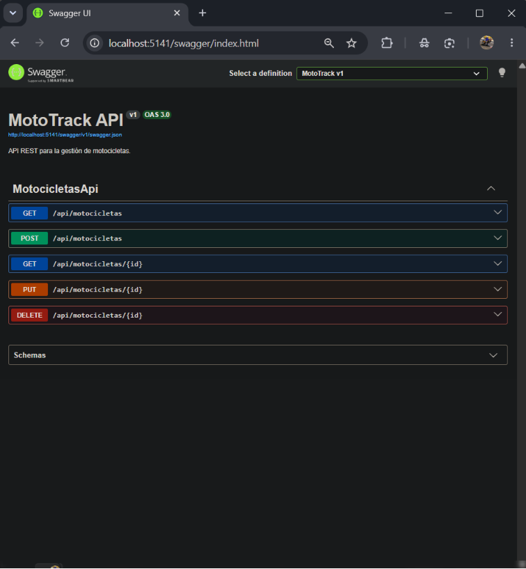
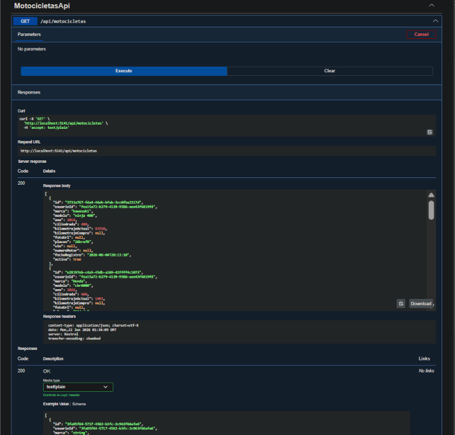

# MotoTrack

## Descripción

MotoTrack es una aplicación web desarrollada en ASP.NET Core MVC para ayudar a los motociclistas a llevar el control de sus motocicletas, registrar mantenimientos y dar seguimiento al kilometraje de cada unidad.

El proyecto fue desarrollado como parte de la materia de Arquitectura de Software y se encuentra en evolución continua mediante entregas incrementales y mejoras por sprint.

---

## Funcionalidades actuales

Actualmente MotoTrack permite:

* Registro e inicio de sesión.
* Gestión de motocicletas (registro, edición, eliminación).
* Historial de mantenimientos.
* Registro de kilometraje.
* Dashboard principal.
* Perfil de usuario.
* Centro de alertas.
* Explorador de motocicletas.
* Gestión de gastos.
* API REST.
* Swagger/OpenAPI.
* Strategy para cálculo de estado de mantenimiento.
* Decorator para trazabilidad de operaciones sobre motocicletas.

---

## Capturas del sistema

### Dashboard con alertas

Panel principal que muestra el estado de mantenimiento de cada motocicleta y las alertas de servicios vencidos o próximos.

<!-- Dashboard con alertas visibles — captura pendiente -->

---

### Mis motocicletas

Sección donde cada usuario puede visualizar las motocicletas registradas en su cuenta y acceder a las principales acciones del sistema.

---

### Historial de mantenimientos

Vista que permite consultar los mantenimientos registrados para una motocicleta específica.

---

### Swagger UI

Interfaz de documentación interactiva de la API REST de MotoTrack.

---

### GET /api/motocicletas

Ejecución del endpoint que lista todas las motocicletas registradas en el sistema, mostrando la respuesta JSON.

---

## Arquitectura del proyecto

El sistema está organizado utilizando una arquitectura por capas para separar responsabilidades y facilitar el mantenimiento del código.

### Estructura principal

* **Capa Web**

  Contiene los controladores, vistas y configuración principal de la aplicación.

* **Capa de Aplicación**

  Contiene los servicios responsables de la lógica de negocio.

* **Capa de Dominio**

  Contiene los modelos e interfaces principales del sistema.

* **Capa de Infraestructura**

  Contiene los repositorios y mecanismos de persistencia de datos.

Actualmente estas capas se encuentran implementadas en proyectos separados dentro de la solución.

---

## Tecnologías utilizadas

* ASP.NET Core MVC
* C#
* Razor Views
* Bootstrap
* JSON para persistencia local
* Git
* GitHub

---

## Roadmap Arquitectónico

| ADR | Etapa | Descripción |
|------|--------|-------------|
| ADR-01 | Arquitectura Inicial | Arquitectura por capas con persistencia JSON |
| ADR-02 | Vistas Arquitectónicas | Documentación mediante modelo 4+1 |
| ADR-03 | Estilo Arquitectónico | Formalización de arquitectura por capas |
| ADR-04 | API REST | Exposición de endpoints REST documentados con Swagger |
| ADR-05 | Patrones GOF | Incorporación de Strategy + Decorator para estado de mantenimiento y trazabilidad |

---

## Documentación Arquitectónica

Las decisiones arquitectónicas del proyecto se encuentran documentadas en:

- docs/adr/ADR-01-Arquitectura-Inicial.md
- docs/adr/ADR-02-Vistas-Arquitectonicas.md
- docs/adr/ADR-03-Estilo-Arquitectonico.md
- docs/adr/ADR-04-Incorporacion-API-REST.md
- docs/adr/ADR-05-Patrones-GOF.md

El uso de herramientas de inteligencia artificial se documenta en:

- docs/IA.md

---

## API REST

MotoTrack incorpora una API REST documentada mediante Swagger.

Endpoints disponibles:

- GET /api/motocicletas
- GET /api/motocicletas/{id}
- POST /api/motocicletas
- PUT /api/motocicletas/{id}
- DELETE /api/motocicletas/{id}

Swagger UI:

/swagger

---

## Estado Actual

MotoTrack cuenta con una arquitectura por capas documentada mediante ADRs, persistencia basada en archivos JSON, una API REST documentada con Swagger y la incorporación de los patrones GOF Strategy y Decorator. El proyecto evoluciona de forma incremental mediante decisiones arquitectónicas registradas formalmente.

---

## Autor

David Morales Guerrero

Tecnológico del Software

Materia: Arquitectura de Software

---

## Uso de Inteligencia Artificial

Se utilizó ChatGPT como herramienta de apoyo para resolver problemas específicos de implementación, analizar errores durante el desarrollo, revisar decisiones arquitectónicas y apoyar la elaboración de documentación técnica del proyecto.

Las decisiones finales de diseño, implementación, pruebas y validación fueron realizadas y verificadas por el autor.
