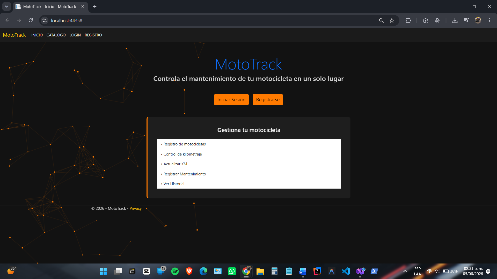
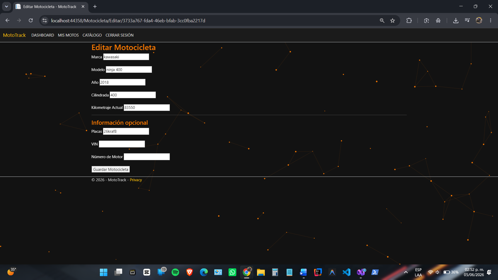

# MotoTrack

## Descripción

MotoTrack es una aplicación web desarrollada en ASP.NET Core MVC para ayudar a los motociclistas a llevar el control de sus motocicletas, registrar mantenimientos y dar seguimiento al kilometraje de cada unidad.

El proyecto fue desarrollado como parte de la materia de Arquitectura de Software y se encuentra en evolución continua mediante entregas incrementales y mejoras por sprint.

---

## Funcionalidades actuales

Actualmente MotoTrack permite:

* Registro de usuarios.
* Inicio y cierre de sesión.
* Registro de motocicletas.
* Edición de motocicletas.
* Eliminación de motocicletas.
* Registro de lecturas de kilometraje.
* Registro de mantenimientos.
* Consulta de historial de mantenimientos.
* Almacenamiento de información mediante archivos JSON.

---

## Capturas del sistema

### Pantalla principal

La página principal permite acceder al sistema y presenta una visión general del propósito de MotoTrack.

---

### Mis motocicletas

Sección donde cada usuario puede visualizar las motocicletas registradas en su cuenta y acceder a las principales acciones del sistema.

---

### Edición de motocicletas

Formulario utilizado para actualizar la información de una motocicleta previamente registrada.

---

### Historial de mantenimientos

Vista que permite consultar los mantenimientos registrados para una motocicleta específica.

---

## Arquitectura del proyecto

El sistema está organizado utilizando una arquitectura por capas para separar responsabilidades y facilitar el mantenimiento del código.

### Estructura principal

* **Capa Web**

  Contiene los controladores, vistas y configuración principal de la aplicación.

* **Capa de Aplicación**

  Contiene los servicios responsables de la lógica de negocio.

* **Capa de Dominio**

  Contiene los modelos e interfaces principales del sistema.

* **Capa de Infraestructura**

  Contiene los repositorios y mecanismos de persistencia de datos.

Actualmente estas capas se encuentran implementadas en proyectos separados dentro de la solución.

---

## Tecnologías utilizadas

* ASP.NET Core MVC
* C#
* Razor Views
* Bootstrap
* JSON para persistencia local
* Git
* GitHub

---

## Estado actual

MotoTrack se encuentra en desarrollo activo.

Las funcionalidades principales para la administración de motocicletas ya se encuentran operativas y actualmente se trabaja en nuevas mejoras relacionadas con visualización de información, experiencia de usuario y gestión de mantenimientos.

---

## Autor

David Morales Guerrero

Tecnológico del Software

Materia: Arquitectura de Software

---

## Uso de Inteligencia Artificial

Se utilizó ChatGPT como herramienta de apoyo para resolver problemas específicos de implementación, analizar errores durante el desarrollo, revisar decisiones arquitectónicas y apoyar la elaboración de documentación técnica del proyecto.

Las decisiones finales de diseño, implementación, pruebas y validación fueron realizadas y verificadas por el autor.
