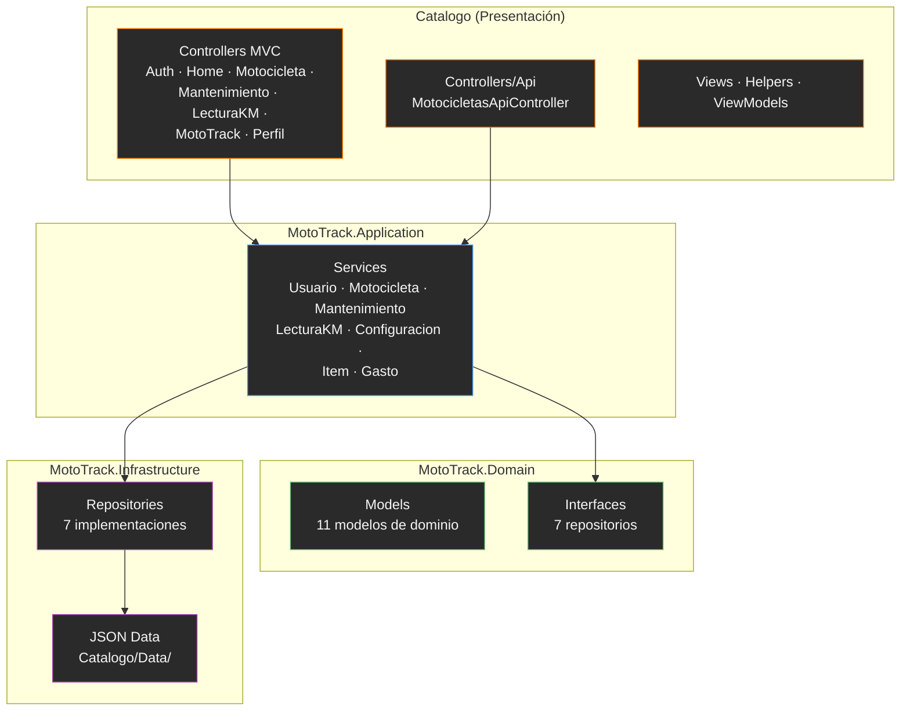

# ADR-03: Selección del Estilo Arquitectónico de MotoTrack

## Estado

Aceptado

## Fecha

2026-06-12

## Autor

David Morales Guerrero

---

## Contexto

MotoTrack se ha estructurado desde su inicio con una separación en proyectos que dividen responsabilidades específicas: una capa web para la interfaz y controladores, una capa de aplicación para los servicios de negocio, una capa de dominio para los modelos y contratos, y una capa de infraestructura para la persistencia.

Conforme el proyecto ha evolucionado y se han incorporado nuevas funcionalidades (dashboard, alertas, centro de notificaciones, API REST, explorador de catálogo), esta organización natural ha resultado efectiva pero no había sido formalizada como decisión arquitectónica explícita.

Dado que el proyecto continúa creciendo, resulta necesario definir formalmente el estilo arquitectónico utilizado para documentar la decisión, facilitar futuras modificaciones y establecer una referencia clara para nuevos desarrolladores.

---

## Decisión

Se adopta una **Arquitectura por Capas (Layered Architecture)** como estilo arquitectónico principal para MotoTrack.

Esta decisión refuerza y formaliza la adopción inicial documentada en ADR-01, detallando los componentes actuales de cada capa según la implementación real del proyecto.

La arquitectura por capas divide el sistema en niveles con responsabilidades claramente definidas, permitiendo mantener una adecuada separación de intereses entre la interfaz de usuario, la lógica de negocio, el dominio del problema y la persistencia de datos.

La implementación actual de MotoTrack sigue este modelo mediante la siguiente estructura:

### Capa de Presentación

Responsable de la interacción con el usuario y la exposición de endpoints HTTP.

**Componentes:**

- Controllers MVC: AuthController, HomeController, LecturaKilometrajeController, MantenimientoController, MotocicletaController, MotoTrackController, PerfilController
- Controllers API: MotocicletasApiController (ruta `/api/motocicletas`)
- Views (Razor)
- Helpers: CalculadorEstadoMantenimiento
- ViewModels: LoginViewModel, PerfilViewModel, RegistrarLecturaViewModel, EstadoMantenimientoResult, ErrorViewModel
- Swagger UI (`/swagger`) para documentación y prueba de la API REST

### Capa de Aplicación

Responsable de coordinar los casos de uso y reglas de negocio.

**Componentes:**

- ConfiguracionMantenimientoService
- GastoService
- ItemService
- LecturaKilometrajeService
- MantenimientoService
- MotocicletaService
- UsuarioService

### Capa de Dominio

Responsable de representar las entidades y contratos principales del sistema.

**Componentes:**

- Models: ConfiguracionMantenimiento, EstadoMantenimientoResult, Gasto, Item, LecturaKilometraje, LoginViewModel, Mantenimiento, Motocicleta, PerfilViewModel, RegistrarLecturaViewModel, Usuario
- Interfaces: IConfiguracionMantenimientoRepository, IGastoRepository, IItemRepository, ILecturaKilometrajeRepository, IMantenimientoRepository, IMotocicletaRepository, IUsuarioRepository

### Capa de Infraestructura

Responsable de la persistencia y acceso a datos.

**Componentes:**

- Repositories: ConfiguracionMantenimientoRepository, GastoRepository, ItemRepository, LecturaKilometrajeRepository, MantenimientoRepository, MotocicletaRepository, UsuarioRepository
- Archivos JSON de almacenamiento en `Catalogo/Data/`

---

## ¿Por qué?

La arquitectura por capas fue seleccionada porque la estructura actual del proyecto ya implementa de forma natural este estilo arquitectónico, evitando refactorizaciones innecesarias y manteniendo la estabilidad del sistema.

Las principales razones son:

- Facilita la separación de responsabilidades.
- Permite mantener una organización clara del código.
- Reduce el acoplamiento entre componentes.
- Facilita el mantenimiento y evolución del sistema.
- Es adecuada para un proyecto académico desarrollado por un solo integrante.
- Permite incorporar nuevas funcionalidades sin afectar significativamente otras partes del sistema.

---

## Alternativas Consideradas

| Alternativa | Descripción | Motivo de descarte |
|---|---|---|
| **Arquitectura Hexagonal** | Aísla el dominio mediante puertos y adaptadores, independizando la lógica de negocio de la infraestructura. | Incrementa significativamente la complejidad del sistema. Para el alcance actual de MotoTrack, los beneficios no justifican el costo de migración. La estructura actual podría evolucionar hacia este estilo si el proyecto lo requiere. |
| **Arquitectura de Microservicios** | Divide el sistema en múltiples servicios independientes desplegados por separado, cada uno con su propio dominio y persistencia. | El tamaño actual de MotoTrack no requiere una separación distribuida. Su adopción implicaría complejidad operativa, de despliegue, monitoreo y mantenimiento que no se justifica para un proyecto individual. |
| **Arquitectura Cliente-Servidor** | Concentra la lógica principal en una única aplicación con poca separación interna entre capas. | A medida que el sistema crece, este enfoque dificulta el mantenimiento y la evolución debido al incremento del acoplamiento entre componentes. No ofrece ventajas sobre la organización actual. |

---

## Consecuencias

### Positivas

- Organización clara del proyecto.
- Separación adecuada de responsabilidades.
- Menor complejidad de desarrollo.
- Facilidad de mantenimiento.
- Curva de aprendizaje reducida.
- Escalabilidad suficiente para el alcance actual del sistema.
- Facilita futuras mejoras y refactorizaciones.

### Negativas

- Menor desacoplamiento que una arquitectura hexagonal.
- Dependencia moderada entre capas.
- Posible necesidad de evolución arquitectónica si el proyecto crece significativamente.

---

## Relación con la Implementación Actual

La arquitectura por capas se encuentra reflejada en la estructura real del proyecto:

```text
MotoTrack
│
├── Catalogo (Presentación MVC + API)
│   ├── Controllers/
│   │   ├── AuthController.cs
│   │   ├── HomeController.cs
│   │   ├── LecturaKilometrajeController.cs
│   │   ├── MantenimientoController.cs
│   │   ├── MotocicletaController.cs
│   │   ├── MotoTrackController.cs
│   │   ├── PerfilController.cs
│   │   └── Api/
│   │       └── MotocicletasApiController.cs
│   ├── Views/
│   ├── Helpers/
│   │   └── CalculadorEstadoMantenimiento.cs
│   ├── Models/
│   │   └── ErrorViewModel.cs
│   └── wwwroot/
│
├── MotoTrack.Application (Servicios)
│   ├── ConfiguracionMantenimientoService.cs
│   ├── GastoService.cs
│   ├── ItemServices.cs
│   ├── LecturaKilometrajeService.cs
│   ├── MantenimientoService.cs
│   ├── MotocicletaService.cs
│   └── UsuarioService.cs
│
├── MotoTrack.Domain (Dominio)
│   ├── Models/
│   │   ├── ConfiguracionMantenimiento.cs
│   │   ├── EstadoMantenimientoResult.cs
│   │   ├── Gasto.cs
│   │   ├── Item.cs
│   │   ├── LecturaKilometraje.cs
│   │   ├── LoginViewModel.cs
│   │   ├── Mantenimiento.cs
│   │   ├── Motocicleta.cs
│   │   ├── PerfilViewModel.cs
│   │   ├── RegistrarLecturaViewModel.cs
│   │   └── Usuario.cs
│   └── Interfaces/
│       ├── IConfiguracionMantenimientoRepository.cs
│       ├── IGastoRepository.cs
│       ├── IItemRepository.cs
│       ├── ILecturaKilometrajeRepository.cs
│       ├── IMantenimientoRepository.cs
│       ├── IMotocicletaRepository.cs
│       └── IUsuarioRepository.cs
│
└── MotoTrack.Infrastructure (Infraestructura)
    └── Repositories/
        ├── ConfiguracionMantenimientoRepository.cs
        ├── GastoRepository.cs
        ├── ItemRepository.cs
        ├── LecturaKilometrajeRepository.cs
        ├── MantenimientoRepository.cs
        ├── MotocicletaRepository.cs
        └── UsuarioRepository.cs
```

Esta organización soporta todas las funcionalidades actualmente implementadas en el sistema y mantiene una separación clara de responsabilidades.

---

## Diagrama

El siguiente diagrama representa la Arquitectura por Capas de MotoTrack con sus componentes reales:



---

> **Nota:** Esta decisión arquitectónica fue posteriormente extendida mediante [ADR-05](ADR-05-Patrones-GOF.md), incorporando los patrones GOF Strategy (Behavioral) y Decorator (Structural) sin modificar el estilo arquitectónico principal basado en capas.
