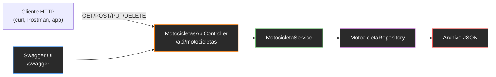

# ADR-01: Incorporación de API REST

## Estado

Aceptado

## Fecha

2026-06-21

## Autor

David Morales Guerrero

---

## Contexto

MotoTrack es una aplicación web desarrollada en ASP.NET Core MVC cuyo propósito es ayudar a los motociclistas a administrar sus vehículos, registrar lecturas de kilometraje y llevar un control de los mantenimientos realizados.

Hasta ahora toda la interacción con el sistema ha sido exclusivamente a través del navegador mediante formularios Razor y controladores MVC tradicionales.

La Actividad #24 requiere exponer endpoints HTTP públicos que permitan la integración programática con el sistema, posibilitando que aplicaciones externas o scripts puedan consultar y manipular los datos de motocicletas sin necesidad de una interfaz gráfica.

---

## Decisión

Se implementa una API REST utilizando controladores Web API de ASP.NET Core, documentada con Swagger/OpenAPI mediante el paquete Swashbuckle.AspNetCore v10.2.2.

La API se despliega dentro del mismo proyecto web existente, compartiendo el mismo proceso y puerto, sin necesidad de un proyecto separado.

### Detalles técnicos

| Aspecto | Decisión |
|---|---|
| Formato | JSON (`application/json`) |
| Ruta base | `/api/motocicletas` |
| Controlador | `MotocicletasApiController` en `Controllers/Api/` |
| Recurso inicial | Motocicletas (único recurso en esta fase) |
| Endpoints | 5 (GET all, GET by id, POST, PUT, DELETE) |
| DTOs | No se utilizan — se expone el modelo `Motocicleta` directamente |
| Documentación | Swagger UI en `/swagger` (todos los entornos) |
| Paquete NuGet | `Swashbuckle.AspNetCore` v10.2.2 |
| Autenticación | No implementada en esta fase |
| Versionado | No implementado en esta fase |

---

## ¿Por qué?

La implementación de una API REST permite que aplicaciones externas, scripts de automatización o futuros clientes móviles puedan interactuar con MotoTrack de forma programática. La exposición de endpoints estandarizados facilita la integración con otros sistemas y sienta las bases para una posible evolución del proyecto hacia una arquitectura más distribuida.

Swagger UI proporciona una interfaz de navegación y prueba interactiva que simplifica el desarrollo y depuración de los endpoints sin requerir herramientas externas.

---

## Alternativas consideradas

| Alternativa | Descripción | Motivo de descarte |
|---|---|---|
| **SOAP** | Protocolo XML sobre HTTP con WSDL para contratos estrictos. Soporte nativo en .NET Framework (WCF). | Verbosidad XML excesiva, complejidad de configuración, bajo rendimiento, obsoleto en ecosistemas modernos. Sobredimensionado para un proyecto con persistencia JSON. |
| **Minimal APIs** | API sobre HTTP con menos ceremonia (sin controllers, lambdas directas en Program.cs). | Escalabilidad limitada al crecer los endpoints. Difícil de testear unitariamente. Pierde organización por controlador. MotoTrack puede crecer en número de endpoints. |
| **GraphQL** | Consultas sobre un solo endpoint con schema tipado (SDL). Cliente solicita exactamente los datos que necesita. | Complejidad de implementación (resolvers, DataLoader, N+1). Caché HTTP difícil. Sobrecarga cognitiva. Los recursos de MotoTrack son planos con relaciones simples. |
| **REST (seleccionado)** | JSON/HTTP con semántica de verbos (GET/POST/PUT/DELETE). Stateless, cacheable, ampliamente soportado. | — |

---

## Consecuencias

### Positivas

- Los endpoints API son accesibles desde cualquier cliente HTTP (curl, Postman, aplicaciones web).
- Swagger UI permite explorar y probar los endpoints sin configuración adicional.
- No se modificaron los controladores MVC existentes ni la lógica de negocio.
- El recurso API comparte el mismo servicio (`MotocicletaService`) que la aplicación web.
- La estructura `Controllers/Api/` permite agregar nuevos recursos siguiendo el mismo patrón.

### Negativas

- Al no usar DTOs, los campos internos del modelo (`Id`, `FechaRegistro`, `UsuarioId`) son editables vía PUT/POST.
- Swagger UI queda accesible en producción (riesgo controlado, sin datos sensibles).
- No hay autenticación ni autorización en los endpoints.
- No hay versionado — cambios futuros en los endpoints podrían romper clientes existentes.

---

## Diagrama

El diagrama anterior muestra el flujo de las solicitudes HTTP desde el cliente o Swagger UI hacia el controlador API, que a su vez utiliza el servicio existente y el repositorio JSON para persistir los datos. La API se integra sin modificar la arquitectura existente.
