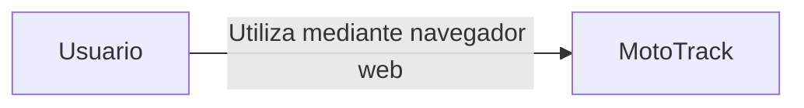

# C4 – Nivel 1: Contexto

## Objetivo

Este nivel representa el contexto general del sistema MotoTrack y la interacción entre el usuario y la aplicación. Es la visión más abstracta del proyecto.

## ¿Para quién está dirigido?

Está dirigido a cualquier persona que necesite comprender el propósito general del sistema sin necesidad de conocer su implementación interna: stakeholders, personas interesadas en comprender el funcionamiento general del sistema y nuevos desarrolladores.

## ¿Qué pregunta responde?

¿Quién utiliza MotoTrack y cómo interactúa con él?

## Diagrama de contexto

## Explicación del diagrama

El diagrama muestra un único actor, el Usuario, que representa a un mecánico o tallerista encargado de administrar el mantenimiento de una o varias motocicletas. Este actor interactúa con MotoTrack exclusivamente a través de un navegador web, sin intermediarios ni sistemas externos.

MotoTrack funciona como un sistema independiente. Actualmente no utiliza servicios externos, no utiliza plataformas en la nube ni depende de APIs de terceros. Toda la funcionalidad del sistema se ejecuta dentro de la propia aplicación.