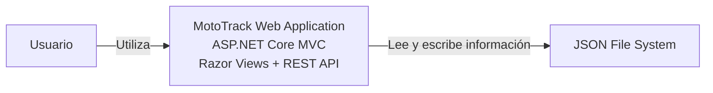

# C4 – Nivel 2: Contenedores

## Objetivo

Este nivel representa los contenedores principales del sistema MotoTrack, sus responsabilidades y la forma en que se comunican entre sí. Un contenedor representa una parte principal del sistema con una responsabilidad claramente definida.

## ¿Para quién está dirigido?

Está dirigido a desarrolladores, arquitectos y revisores técnicos que necesiten comprender la estructura de alto nivel del sistema sin entrar en detalles de implementación interna.

## ¿Qué pregunta responde?

¿Cuáles son los contenedores que componen MotoTrack y cómo se relacionan entre sí?

## Diagrama de contenedores

## Explicación del diagrama

El diagrama muestra dos contenedores. El primero es la **Web Application**, implementada con ASP.NET Core (.NET 10), que proporciona dos interfaces de usuario: una aplicación MVC que sirve HTML mediante Razor Views y una API REST que expone endpoints documentados con Swagger. Ambos interfaces forman parte del mismo proceso de aplicación y comparten la misma lógica de negocio y repositorios.

El segundo contenedor es el **JSON File System**, que almacena toda la información del sistema en archivos JSON planos ubicados en el directorio `Data/` del proyecto. La Web Application realiza operaciones de lectura y escritura sobre estos archivos para persistir la información.

Swagger no es un contenedor independiente, sino una herramienta de documentación y exploración incluida como middleware dentro de la API REST. Se utiliza durante el desarrollo para visualizar y probar los endpoints disponibles.