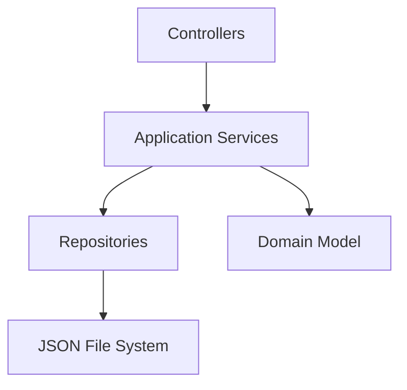

# C4 – Nivel 3: Componentes

## Objetivo

Este nivel muestra los principales componentes internos de la Web Application de MotoTrack y la forma en que colaboran entre sí para proporcionar la funcionalidad del sistema.

## ¿Para quién está dirigido?

Está dirigido a desarrolladores y arquitectos interesados en comprender la organización interna del contenedor principal del sistema, sin necesidad de revisar el código fuente directamente.

## ¿Qué pregunta responde?

¿Qué componentes principales existen dentro de MotoTrack Web Application y cómo colaboran entre sí?

## Diagrama de componentes

## Explicación del diagrama

El diagrama representa los cinco componentes principales de la Web Application. **Controllers** reciben las solicitudes HTTP y delegan la lógica de negocio a los **Application Services**. Estos servicios orquestan las operaciones del sistema apoyándose en los **Repositories**, que gestionan la persistencia de la información mediante archivos JSON. El **Domain Model** contiene las entidades y reglas del negocio, utilizado por los Application Services como base para sus operaciones.

Los Application Services utilizan el patrón **Strategy** para encapsular la lógica de cálculo del estado de mantenimiento. Además, algunos Repositories implementan el patrón **Decorator** para incorporar responsabilidades transversales, como el registro de operaciones, sin modificar su comportamiento original.

Existen componentes auxiliares como el catálogo de conocimiento sobre mantenimiento y los Helpers reutilizables que apoyan la lógica del sistema, pero no forman parte de la estructura principal representada en el diagrama.