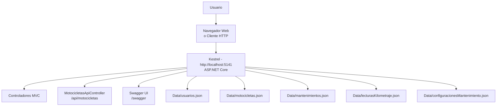

# Vista de Despliegue

## Descripción

La vista de despliegue muestra cómo se ejecuta actualmente MotoTrack y los elementos físicos involucrados en su funcionamiento.

## Interpretación

MotoTrack se ejecuta en un entorno local de desarrollo utilizando Kestrel (`dotnet run`, perfil `http` en puerto 5141 o `https` en puerto 7116). Los usuarios acceden mediante un navegador web (interfaz MVC) o mediante clientes HTTP (API REST). Swagger UI está disponible en `/swagger` para explorar y probar los endpoints. Toda la información se almacena en archivos JSON dentro del directorio `Catalogo/Data/`. También existe un perfil `IIS Express` opcional en `launchSettings.json`.
