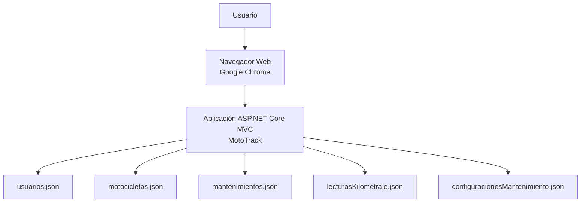

# Vista de Despliegue

## Descripción

La vista de despliegue muestra cómo se ejecuta actualmente MotoTrack y los elementos físicos involucrados en su funcionamiento.

## Interpretación

Actualmente MotoTrack se ejecuta en un entorno local de desarrollo utilizando ASP.NET Core MVC sobre IIS Express. Los usuarios acceden al sistema mediante un navegador web y la información es almacenada en archivos JSON utilizados como mecanismo de persistencia.