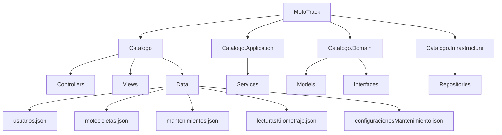

# Vista Física

## Descripción

La vista física representa la organización de los proyectos que conforman la solución MotoTrack y la ubicación de los archivos de persistencia utilizados por el sistema.

## Interpretación

MotoTrack se encuentra dividido en múltiples proyectos que permiten separar responsabilidades. La capa web contiene los controladores y vistas, la capa de aplicación contiene la lógica de negocio, la capa de dominio define los modelos e interfaces, mientras que la capa de infraestructura implementa la persistencia de datos mediante repositorios y archivos JSON.