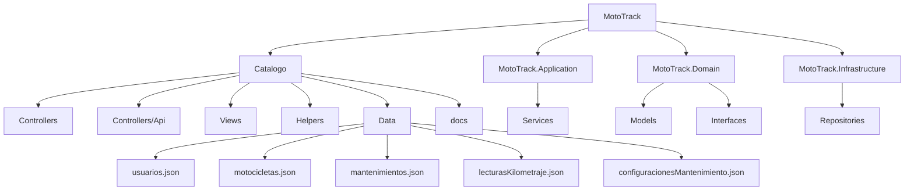

# Vista Física

## Descripción

La vista física representa la organización de los proyectos que conforman la solución MotoTrack y la ubicación de los archivos de persistencia utilizados por el sistema.

## Interpretación

MotoTrack se encuentra dividido en múltiples proyectos que permiten separar responsabilidades. La capa web (`Catalogo`) contiene los controladores MVC y API, vistas, helpers, la documentación técnica y los archivos JSON de persistencia. La capa de aplicación (`MotoTrack.Application`) contiene la lógica de negocio mediante servicios. La capa de dominio (`MotoTrack.Domain`) define los modelos e interfaces del sistema. La capa de infraestructura (`MotoTrack.Infrastructure`) implementa los repositorios que leen y escriben los archivos JSON en `Catalogo/Data/`.
