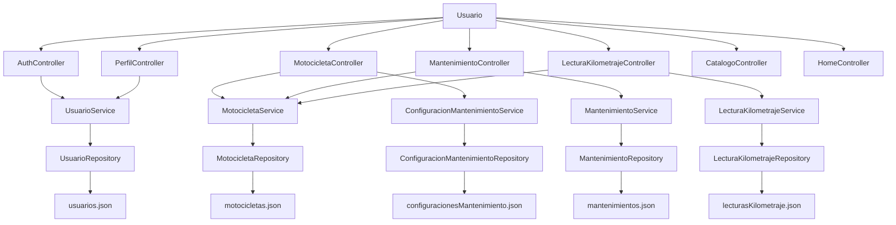

Vista Lógica

## Descripción

La vista lógica muestra los principales componentes funcionales de MotoTrack y las relaciones entre la interfaz de usuario, los controladores, los servicios, los repositorios y la persistencia de datos.

## Interpretación

MotoTrack utiliza una arquitectura por capas donde los usuarios interactúan con controladores MVC. Los controladores delegan la lógica de negocio a los servicios correspondientes y estos utilizan repositorios para acceder a la información almacenada en archivos JSON.