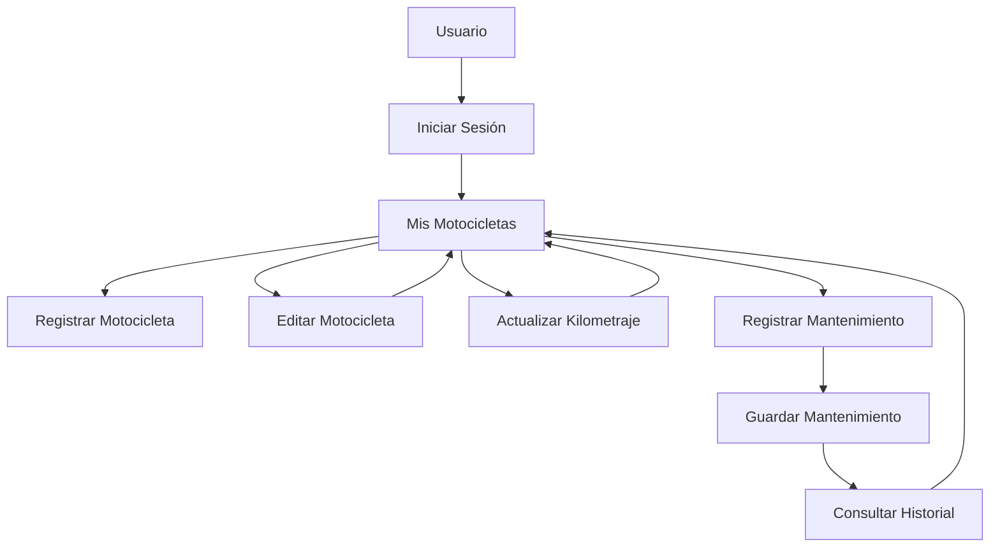

# Vista de Procesos

## Descripción

La vista de procesos representa el flujo principal de interacción de un usuario dentro de MotoTrack, mostrando las actividades más importantes que puede realizar dentro del sistema.



## Interpretación

El proceso principal de MotoTrack inicia cuando el usuario accede al sistema mediante el inicio de sesión. Una vez autenticado, puede administrar sus motocicletas registradas, actualizar kilometraje, registrar mantenimientos y consultar el historial de servicios realizados.

Este flujo representa los escenarios de uso más importantes del sistema y sirve como elemento integrador de las demás vistas arquitectónicas.
```