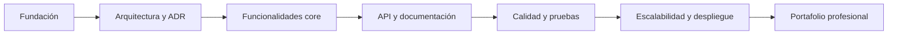

# Roadmap

## Objetivo

Describir la evolución planificada de MotoTrack como proyecto profesional de portafolio, definiendo los hitos estratégicos y la visión a largo plazo.

## Alcance

Este documento cubre la trayectoria del proyecto desde su base documental hasta su madurez como sistema demostrable.

## Visión del proyecto

MotoTrack evolucionará de un proyecto académico a una aplicación demo profesional que demuestre principios sólidos de arquitectura de software, documentación estructurada y calidad de código.

## Evolución planificada

## Hitos principales

| Hito | Descripción |
|---|---|
| Fundación | Estructura documental, estándares, estándares de desarrollo |
| Arquitectura | Definir y documentar la arquitectura (ADR, C4, diagramas) |
| Funcionalidades core | Dashboard, mantenimientos, kilometraje, alertas, catálogo |
| API y documentación | API REST documentada con Swagger y documentación de consumo |
| Calidad y pruebas | Proyecto de tests, linting, análisis estático |
| Escalabilidad | Migración de persistencia, optimización, contenedores |

## Buenas prácticas

- Cada hito debe completarse antes de comenzar el siguiente.
- Cada hito debe producir evidencia documental y de código.
- El roadmap puede reajustarse según prioridades del proyecto.

## Consideraciones finales

Este roadmap es una guía, no una restricción. Los hitos pueden solaparse cuando sea técnicamente viable y no comprometa la calidad del proyecto.