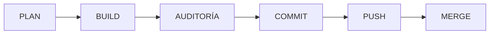

# Estándar de Desarrollo

## Objetivo

Definir la metodología oficial de MotoTrack. Este documento establece cómo se planifica, implementa, audita y entrega cada cambio, asegurando que el proyecto evolucione de forma ordenada y profesional.

No describe simplemente qué se hace. Explica por qué cada etapa existe y cómo contribuye a la calidad del proyecto.

## Alcance

Aplica a toda actividad que modifique el código, la documentación o la arquitectura de MotoTrack.

## Desarrollo

### Filosofía

MotoTrack no se construye escribiendo código rápidamente. Se construye tomando decisiones primero.

Cada línea de código existió primero como una decisión arquitectónica. Esto significa que antes de programar se analiza el impacto, las alternativas y la coherencia con el resto del sistema. No se implementa nada que no haya sido planificado.

El proyecto es un portafolio profesional, no una colección de entregables académicos. Cada actividad deja el proyecto mejor de lo que estaba.

### Desarrollo guiado por arquitectura

La arquitectura dirige las implementaciones, no al revés. Ningún cambio puede romper la separación de capas, los patrones establecidos o las decisiones registradas en los ADR.

Si un cambio requiere modificar la arquitectura, primero debe actualizarse la documentación arquitectónica y registrar un nuevo ADR. Solo después puede comenzar la implementación.

### Planificación antes de programar

Toda actividad comienza con una fase de análisis. Durante esta etapa se responde:

- ¿Qué se necesita exactamente?
- ¿Cómo afecta a la arquitectura actual?
- ¿Requiere nuevos componentes o modifica los existentes?
- ¿Afecta documentación, diagramas o ADR?
- ¿Existen alternativas?
- ¿Cuál es el riesgo de implementarlo?

El objetivo es tener respuestas antes de escribir código. Si una pregunta no puede responderse, la actividad no está lista para implementarse.

### Implementaciones pequeñas

Cada actividad se divide en cambios pequeños y verificables. Una implementación nunca abarca múltiples objetivos al mismo tiempo.

Esto permite:
- Auditar cada cambio de forma aislada.
- Mantener un historial claro.
- Revertir fácilmente si algo sale mal.

### Auditorías obligatorias

Antes de cada commit se ejecuta una auditoría que verifica:

- Compilación correcta sin errores ni warnings.
- Arquitectura consistente con la documentación.
- Documentación actualizada.
- Diagramas sincronizados con el código.
- Calidad del código.
- Estructura del proyecto respetada.

Ningún cambio llega a commit sin pasar por auditoría.

### Commits pequeños

Cada commit representa un avance atómico. Un commit debe responder a una sola pregunta: ¿qué cambió exactamente?

No se mezclan correcciones con funcionalidades nuevas. No se mezcla documentación con código. Si hay múltiples objetivos, hay múltiples commits.

### Evolución incremental

MotoTrack no se reescribe. Se refina.

Cada actividad toma el estado actual del proyecto y lo mejora un paso. No se permiten reestructuraciones masivas ni cambios que no puedan auditarse en una sola revisión.

### Documentación viva

La documentación no es un entregable estático. Es parte activa del proyecto.

Cuando cambia el código, la documentación relacionada debe actualizarse en el mismo ciclo de trabajo. No se permite documentación desactualizada.

### Flujo oficial del proyecto

Cada flecha representa una validación. No se avanza a la siguiente etapa sin completar la anterior.

## Buenas prácticas

- Una actividad, una rama, un objetivo.
- No implementar sin planificación.
- No commitear sin auditoría.
- Si la auditoría falla, corregir antes de continuar.
- La documentación se actualiza en el mismo ciclo que el código.

## Consideraciones finales

Este estándar representa cómo trabaja MotoTrack. No es una sugerencia. Cualquier desviación debe justificarse y documentarse. El estándar mismo puede evolucionar mediante el mismo flujo que cualquier otra actividad.