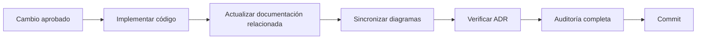

# Estándar de Documentación

## Objetivo

Establecer la estrategia documental de MotoTrack. La documentación no es un accesorio del proyecto. Es un activo que debe mantenerse sincronizado con el código y la arquitectura en todo momento.

## Alcance

Aplica a toda la documentación dentro de `docs/`, incluyendo ADR, diagramas, C4, estándares, roadmap y cualquier documento técnico futuro.

## Desarrollo

### Organización documental

Cada carpeta dentro de `docs/` tiene una responsabilidad única y exclusiva:

| Carpeta | Responsabilidad |
|---|---|
| `docs/adr/` | Decisiones arquitectónicas registradas cronológicamente |
| `docs/diagramas/` | Vistas arquitectónicas 4+1 (lógica, procesos, física, despliegue) |
| `docs/c4/` | Modelo C4: contexto, contenedores y componentes del sistema |
| `docs/standards/` | Estándares que rigen el desarrollo, la documentación y Git |
| `docs/roadmap/` | Planificación estratégica, backlog y registro de cambios |
| `docs/knowledge/` | Base de conocimiento sobre mantenimiento de motocicletas |

No se permite información duplicada entre carpetas. Si un tema pertenece a una categoría, vive únicamente allí.

### README como índice

Cada carpeta de documentación contiene un `README.md` que funciona como índice. Su propósito es explicar qué contiene la carpeta y hacia dónde debe dirigirse el lector según lo que necesite.

Los README no contienen información técnica. Son mapas de navegación.

### Principio de responsabilidad única

Cada documento responde a una sola pregunta:

- Un ADR responde: ¿por qué se tomó esta decisión arquitectónica?
- Un diagrama responde: ¿cómo se estructura esta vista del sistema?
- Un estándar responde: ¿cómo se hace X en MotoTrack?
- El roadmap responde: ¿hacia dónde va el proyecto?
- El backlog responde: ¿qué falta por hacer?
- El changelog responde: ¿qué cambió y cuándo?

Si un documento intenta responder dos preguntas, debe dividirse.

### Sincronización con el código

Cuando se aprueba un cambio, la documentación no se actualiza después. Se actualiza como parte del mismo ciclo de trabajo.

El flujo de actualización documental en MotoTrack es el siguiente:

La documentación se valida en la auditoría, no después. Si falta una actualización documental, la auditoría falla y el cambio no se integra.

## Buenas prácticas

- Si el cambio afecta la arquitectura, crear o actualizar un ADR antes de implementar.
- Si el cambio agrega o modifica componentes, actualizar diagramas y C4.
- Si el cambio introduce una nueva funcionalidad, verificar que el backlog y roadmap lo reflejen.
- No mezclar cambios de documentación con cambios de código en el mismo commit.

## Consideraciones finales

Este estándar asegura que la documentación de MotoTrack sea siempre un reflejo fiel del proyecto. La documentación desactualizada es deuda técnica. Se trata igual que el código mal escrito: debe corregirse.