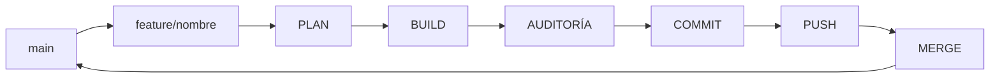

# Estándar de Git

## Objetivo

Definir las convenciones de Git específicas de MotoTrack. El historial del proyecto debe ser limpio, trazable y profesional. Cada commit debe contar una historia clara de la evolución del sistema.

## Alcance

Aplica a todas las actividades que impliquen cambios en el repositorio de MotoTrack.

## Desarrollo

### Estrategia de ramas

MotoTrack utiliza ramas temporales por objetivo. Cada rama representa una sola actividad y se elimina después de integrarse.

Esto permite:
- Aislar cambios hasta que estén auditados.
- Mantener `main` siempre estable y funcional.
- Revisar cada actividad de forma independiente.

### Flujo Git completo en MotoTrack



Cada etapa es obligatoria. No se salta PLAN. No se salta AUDITORÍA. No se integra sin pasar por todas las validaciones.

### Por qué ramas por objetivo

Cada rama `feature/<nombre>` encapsula una actividad completa. Esto asegura que `main` solo contenga cambios auditados y que cada integración sea un evento claro en el historial.

Si una rama crece demasiado, debe dividirse en actividades más pequeñas.

### Por qué commits pequeños

Un commit pequeño es fácil de auditar, fácil de revertir y fácil de entender. Si un commit requiere más de una línea para describirse, probablemente deberían ser dos commits.

### Convención de commits

Cada mensaje sigue el formato:

```
<tipo>: <descripción breve>
```

| Tipo | Uso |
|---|---|
| `feat` | Nueva funcionalidad |
| `fix` | Corrección de errores |
| `docs` | Documentación |
| `refactor` | Refactorización sin cambio funcional |
| `style` | Formato o estilo |
| `chore` | Mantenimiento |
| `audit` | Auditoría o revisión |

Ejemplos reales del proyecto:

- `feat: agregar dashboard con alertas de mantenimiento`
- `docs: actualizar ADR-04 con decisiones de API REST`
- `fix: corregir cálculo de kilometraje restante`
- `audit: validar arquitectura antes de merge`

### Flujo de trabajo paso a paso

1. Crear rama `feature/<nombre>` desde `main`.
2. Ejecutar PLAN: analizar arquitectura, impacto y documentación.
3. Ejecutar BUILD: implementar el cambio aprobado.
4. Ejecutar AUDITORÍA: verificar compilación, documentación y calidad.
5. Realizar commit con mensaje descriptivo.
6. Hacer push de la rama.
7. Integrar a `main` mediante merge.
8. Eliminar la rama temporal.

## Buenas prácticas

- Un commit, un objetivo.
- No commitear en `main`.
- `main` siempre compila y pasa auditoría.
- Si una rama se vuelve compleja, dividirla en actividades más pequeñas.

## Consideraciones finales

Este estándar garantiza que el historial de MotoTrack sea profesional y navegable. Cualquier desviación debe documentarse y justificarse en el mensaje de merge.